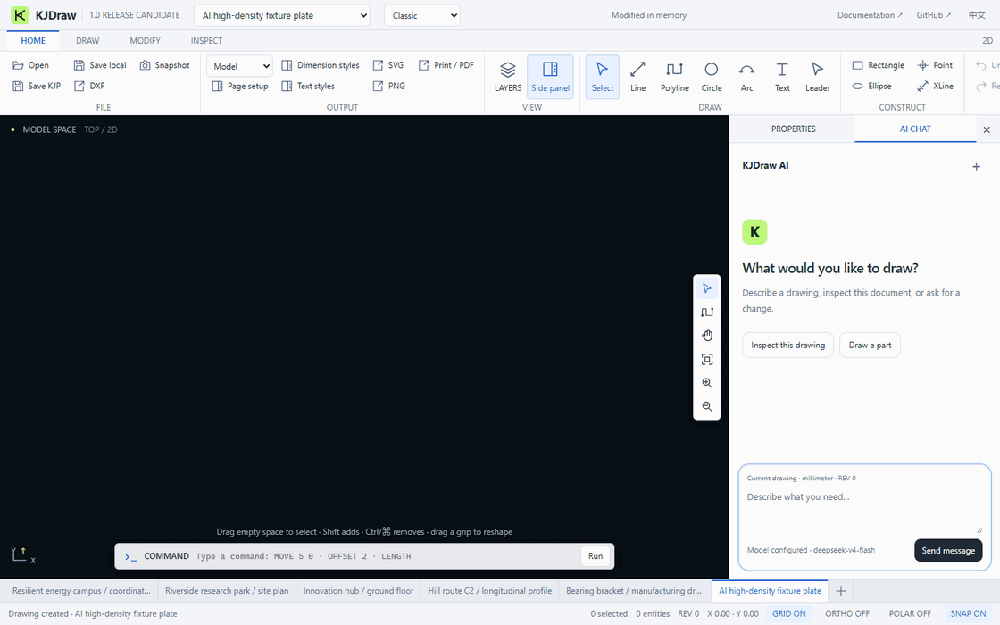

<p align="center"></p>

<h1 align="center">KJDraw</h1>

<p align="center"><strong>CAD infrastructure for engineering applications and AI agents.</strong></p>

<p align="center">An open-source CAD engine and ready-to-use editor.<br>Create, edit, and automate engineering drawings — with code, with an agent, or by hand.</p>

<p align="center">
  <a href="https://kanjieteam.github.io/kjdraw/"><strong>Try the editor</strong></a> ·
  <a href="#add-cad-to-your-app"><strong>Add CAD to your app</strong></a> ·
  <a href="#give-your-agent-cad-tools"><strong>Build a CAD agent</strong></a> ·
  <a href="README.zh-CN.md">简体中文</a>
</p>

<p align="center">
  <a href="https://github.com/KanJieTeam/kjdraw/releases"></a>
  <a href="https://www.npmjs.com/package/@kanjieteam/kjdraw"></a>
  <a href="https://kanjieteam.github.io/kjdraw/docs/latest/"></a>
  <a href="LICENSE"></a>
</p>

<p align="center"><a href="https://kanjieteam.github.io/kjdraw/"></a></p>

<p align="center"><sub>Recorded real-model run: 1 call · 2,935 total tokens · 409 editable objects · saved and reopened.</sub></p>

## Why KJDraw?

- **Give your agent CAD tools.** Read drawing objects, call drawing commands, and review proposed changes through a programmable API.
- **Add CAD without starting from scratch.** Bring drawing tools, layers, properties and file operations into your JavaScript, React or Vue application.
- **Use the editor. Extend the engine.** Start with the packaged interface, customize the workspace, or build your own tools on the CAD engine.

## Try the editor

[Open the editor](https://kanjieteam.github.io/kjdraw/)—no account or upload required to try the samples.

1. Choose a mechanical detail, building floor plan, site plan or road profile.
2. Select objects, move them, inspect their layers or start drawing a part of your own.
3. Undo a change, save the drawing, and open it again to keep working.

The included sample drawings are for exploration, not construction. The [workbench guide](https://kanjieteam.github.io/kjdraw/docs/latest/workbench/) explains drawing, selection, dimensions and saving.

## Add CAD to your app

Install the release-candidate channel:

```sh
npm install @kanjieteam/kjdraw@next
```

These examples require **1.0.0-rc.3 or newer**. Use the `next` channel; `latest` may be older. See [release status](docs/status.md) for published versions and source changes not yet on npm.

### JavaScript / TypeScript

Give the editor a container with a height:

```html
<div id="cad" style="height: 720px"></div>
```

```ts
import { createKJDrawEditor } from '@kanjieteam/kjdraw/editor'

const editor = createKJDrawEditor('#cad', {
  document: 'sample',
  locale: 'en',
  theme: 'dark',
  layout: 'classic',
})

await editor.ready
// await editor.open(file) // File from your file picker
// await editor.save({ format: 'DXF', download: true })
```

### React

In an existing React application:

```tsx
import { KJDraw } from '@kanjieteam/kjdraw/react'

export default function DrawingPage() {
  return <KJDraw document="sample" locale="en" style={{ height: 720 }} />
}
```

### Vue

In an existing Vue 3 application:

```vue
<script setup lang="ts">
import { KJDraw } from '@kanjieteam/kjdraw/vue'
</script>

<template>
  <KJDraw document="sample" locale="en" style="height: 720px" />
</template>
```

Choose **Classic**, **Compact** or **Focus** to suit your application. Changing the layout keeps the drawing and Undo history.

[Quickstart](https://kanjieteam.github.io/kjdraw/docs/latest/quickstart/) · [React guide](https://kanjieteam.github.io/kjdraw/docs/latest/react/) · [Vue guide](https://kanjieteam.github.io/kjdraw/docs/latest/vue/) · [Runnable examples](packages/kjdraw-sdk/examples)

## Give your agent CAD tools

Your application supplies the AI model; KJDraw supplies the CAD tools. Connect your agent to create and modify drawing objects, preview supported changes for approval, and apply edits that users can continue working on or undo.

For example, an agent host can turn a request to move selected equipment into a proposed move, ask the user to approve it, and apply it to the same drawing. The approved edit can be undone like a manual edit.

- [Build an Agent workflow](https://kanjieteam.github.io/kjdraw/docs/latest/agent/): call drawing tools, review a change and apply it.
- [Agent integration guide](docs/agent.md): integration instructions for coding agents.
- [Run the command example](examples/agent-command.mjs): exercise a proposed edit, approval and Undo without a model or API key.

## Files and automation

Read, edit and save drawings from code or the CLI, without an AI model. See the [file guide](https://kanjieteam.github.io/kjdraw/docs/latest/files/) for examples.

KJDraw supports native KJD drawings and KJP projects, plus a documented [DXF compatibility range](docs/dxf-compatibility.md). Direct DWG support is not included.

## Contributing

**Our mission is to make KJDraw the default open-source CAD engine for the AI era.**

Bring a drawing that exposes a bug, build an integration, or help improve the engine. Work that directly helps users includes geometry and file compatibility, editing tools, Agent examples, accessibility, performance and documentation.

Read [Contributing](CONTRIBUTING.md) for the development workflow and [Governance](GOVERNANCE.md) for how decisions and maintenance work. For substantial changes, open an [issue](https://github.com/KanJieTeam/kjdraw/issues) to discuss the design first.

```sh
git clone https://github.com/KanJieTeam/kjdraw.git
cd kjdraw
npm ci --ignore-scripts
npm run dev
```

Open **http://localhost:4173**. Before submitting changes, run `npm run typecheck` and `npm test`; UI changes also need `npm run test:browser`.

[Documentation](https://kanjieteam.github.io/kjdraw/docs/latest/) · [API reference](https://kanjieteam.github.io/kjdraw/docs/latest/api/) · [Roadmap](docs/roadmap.md) · [Support](SUPPORT.md) · [Release status](docs/status.md) · [License](LICENSE)

**Built by [KanJieTeam](https://github.com/KanJieTeam), open to contributors everywhere.**

[kanjieteam@163.com](mailto:kanjieteam@163.com) · Apache-2.0
