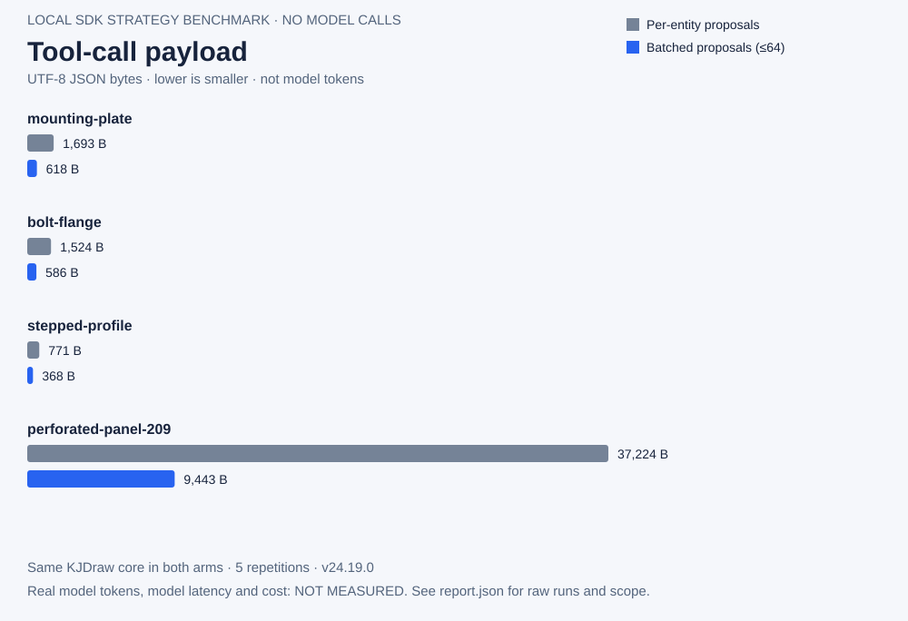
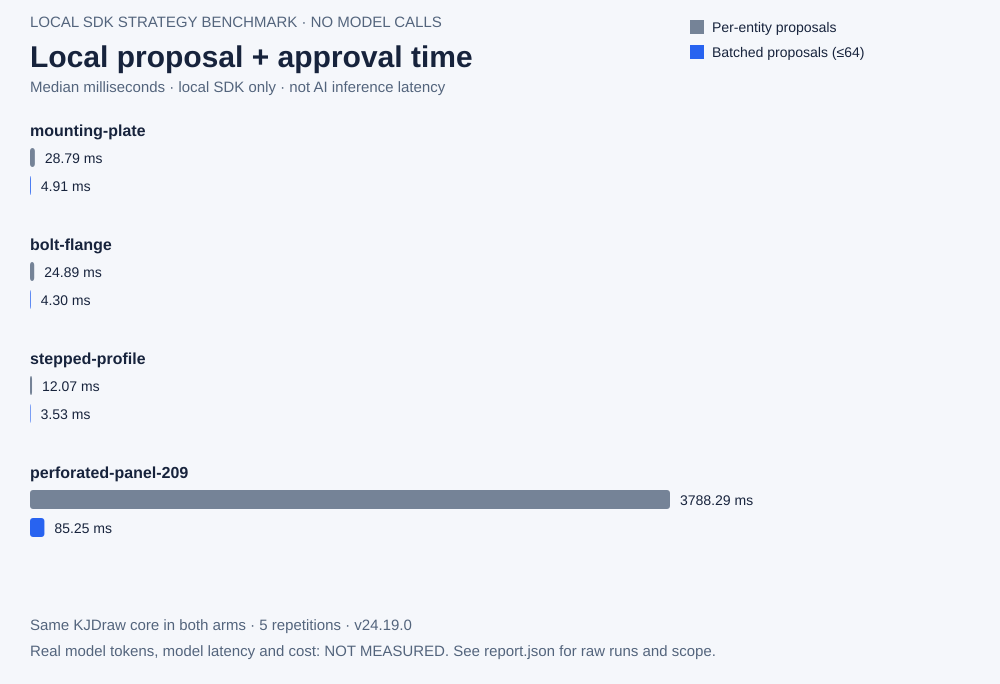
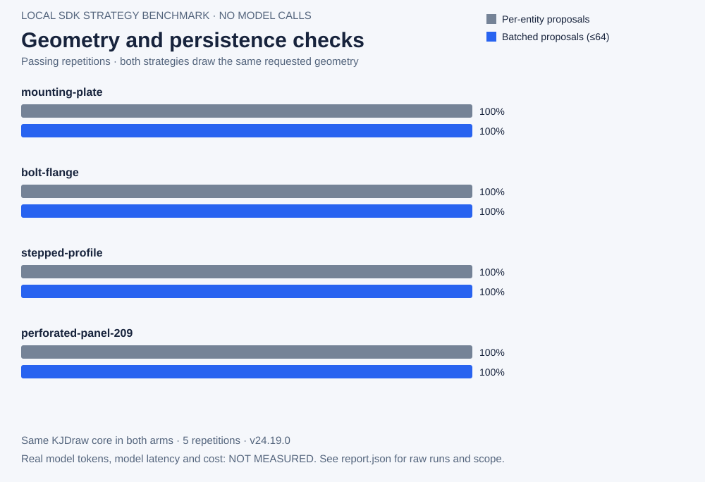

<p align="center"></p>

<h1 align="center">KJDraw</h1>

<p align="center"><strong>CAD infrastructure for engineering applications and AI agents.</strong></p>

<p align="center">An open-source CAD engine and ready-to-use editor.<br>Create, edit, and automate engineering drawings — with code, with an agent, or by hand.</p>

<p align="center"><strong>Our goal: one prompt, a few requirements — AI draws a complete, complex CAD drawing.</strong></p>

<p align="center">
  <a href="https://kanjieteam.github.io/kjdraw/"><strong>Try the editor</strong></a> ·
  <a href="#add-cad-to-your-app"><strong>Add CAD to your app</strong></a> ·
  <a href="#give-your-agent-cad-tools"><strong>Build a CAD agent</strong></a> ·
  <a href="README.zh-CN.md">简体中文</a>
</p>

<p align="center">
  <a href="https://github.com/KanJieTeam/kjdraw/releases"></a>
  <a href="https://www.npmjs.com/package/@kanjieteam/kjdraw"></a>
  <a href="https://kanjieteam.github.io/kjdraw/docs/latest/"></a>
  <a href="LICENSE"></a>
</p>

<p align="center"><a href="https://kanjieteam.github.io/kjdraw/"></a></p>

<p align="center"><sub>Recorded in the workbench: explore drawings, review a preset change, then draw and dimension a part. The built-in Agent scene uses a preset workflow, not a connected language model.</sub></p>

## From a few requirements to a complete drawing

Describe what you need. Our goal is for AI to work through the details and deliver a complex engineering drawing with editable geometry, dimensions, layers and layouts. Continue the conversation to revise it, and keep working in the same CAD document.

We are building toward this workflow: **understand requirements → break down the drawing → construct and check each part → correct errors → deliver a verified drawing**. The architecture needs a persistent drawing workspace, focused context for each task, reusable CAD operations and independent geometry checks. Completion means satisfying the requested geometry and relationships, retaining editable objects, and passing save/reopen and output checks.

The intended architecture has three layers: a precise CAD core, a model-neutral task executor, and versioned capability packs (Skills) for reusable industry methods and user preferences. Users should be able to improve, share and upgrade those packs while continuing to edit existing drawings. Skills guide the work; executable CAD operations and geometry checks establish whether it is correct. This complete workflow remains under development.

**The next README animation target:** type a scenario and a few requirements into the editor's conversation panel, watch a real AI model build a complex drawing, then zoom in to inspect the details and request a revision. We will record it after the actual workflow passes geometry and save/reopen checks, with the prompt, model, elapsed time and reproducible drawing available alongside it.

**Current status:** bounded drawing queries, geometry proposals, previews, host approval and undo/redo are implemented. Autonomous delivery of complete complex drawings is still in development; the animation above demonstrates today's editor. The [1.0 delivery programme](docs/product/1.0-delivery-plan.zh-CN.md) tracks the remaining work and acceptance requirements.

## Why KJDraw?

### Reproducible drawing benchmarks

The first measured comparison tests **per-entity versus batched proposals inside the same KJDraw core**: four original tasks, five repetitions per strategy, actual editable CAD output, geometry checks, KJD/DXF reopening and undo/redo. Both strategies passed all 20 measured runs. On the 209-entity panel, batching reduced calls from 209 to 4 and call-envelope JSON from 37,224 to 9,443 bytes; local proposal/approval median time was 3,788 ms versus 85 ms on this workstation. This measures CAD batching, not model inference. Real model tokens, latency and cost are not yet measured in this comparison.





[Method and reproduction command](docs/product/local-drawing-strategy-benchmark.md) · [Raw runs and source fingerprints](docs/benchmarks/local-drawing-strategies-2026-09-10/report.json) · [Actual 209-entity drawing](docs/benchmarks/local-drawing-strategies-2026-09-10/perforated-panel-209-batched-64-1.svg) · [Editable DXF](docs/benchmarks/local-drawing-strategies-2026-09-10/perforated-panel-209-batched-64-1.dxf)

The next benchmark stage compares real model runs with the same tasks and settings, provider-reported tokens and cache usage, elapsed time, failures and independent geometry requirements. Results will show parity or regressions as well as improvements; this local run establishes no model leaderboard position or quality advantage.

### Build on the engine

- **Give your agent CAD tools.** Read drawing objects, call drawing commands, and review proposed changes through a programmable API.
- **Add CAD without starting from scratch.** Bring drawing tools, layers, properties and file operations into your JavaScript, React or Vue application.
- **Use the editor. Extend the engine.** Start with the packaged interface, customize the workspace, or build your own tools on the CAD engine.

## Try the editor

[Open the editor](https://kanjieteam.github.io/kjdraw/)—no account or upload required to try the samples.

1. Choose a mechanical detail, building floor plan, site plan or road profile.
2. Select objects, move them, inspect their layers or start drawing a part of your own.
3. Undo a change, save the drawing, and open it again to keep working.

The included sample drawings are for exploration, not construction. The [workbench guide](https://kanjieteam.github.io/kjdraw/docs/latest/workbench/) explains drawing, selection, dimensions and saving.

## Add CAD to your app

Install the release-candidate channel:

```sh
npm install @kanjieteam/kjdraw@next
```

These examples require **1.0.0-rc.3 or newer**. Use the `next` channel; `latest` may be older. See [release status](docs/status.md) for published versions and source changes not yet on npm.

### JavaScript / TypeScript

Give the editor a container with a height:

```html
<div id="cad" style="height: 720px"></div>
```

```ts
import { createKJDrawEditor } from '@kanjieteam/kjdraw/editor'

const editor = createKJDrawEditor('#cad', {
  document: 'sample',
  locale: 'en',
  theme: 'dark',
  layout: 'classic',
})

await editor.ready
// await editor.open(file) // File from your file picker
// await editor.save({ format: 'DXF', download: true })
```

### React

In an existing React application:

```tsx
import { KJDraw } from '@kanjieteam/kjdraw/react'

export default function DrawingPage() {
  return <KJDraw document="sample" locale="en" style={{ height: 720 }} />
}
```

### Vue

In an existing Vue 3 application:

```vue
<script setup lang="ts">
import { KJDraw } from '@kanjieteam/kjdraw/vue'
</script>

<template>
  <KJDraw document="sample" locale="en" style="height: 720px" />
</template>
```

Choose **Classic**, **Compact** or **Focus** to suit your application. Changing the layout keeps the drawing and Undo history.

[Quickstart](https://kanjieteam.github.io/kjdraw/docs/latest/quickstart/) · [React guide](https://kanjieteam.github.io/kjdraw/docs/latest/react/) · [Vue guide](https://kanjieteam.github.io/kjdraw/docs/latest/vue/) · [Runnable examples](packages/kjdraw-sdk/examples)

## Give your agent CAD tools

Your application supplies the AI model; KJDraw supplies the CAD tools. Connect your agent to create and modify drawing objects, preview supported changes for approval, and apply edits that users can continue working on or undo.

For example, an agent host can turn a request to move selected equipment into a proposed move, ask the user to approve it, and apply it to the same drawing. The approved edit can be undone like a manual edit.

- [Build an Agent workflow](https://kanjieteam.github.io/kjdraw/docs/latest/agent/): call drawing tools, review a change and apply it.
- [Agent integration guide](docs/agent.md): integration instructions for coding agents.
- [Run the command example](examples/agent-command.mjs): exercise a proposed edit, approval and Undo without a model or API key.

## Files and automation

Read, edit and save drawings from code or the CLI, without an AI model. See the [file guide](https://kanjieteam.github.io/kjdraw/docs/latest/files/) for examples.

KJDraw supports native KJD drawings and KJP projects, plus a documented [DXF compatibility range](docs/dxf-compatibility.md). Direct DWG support is not included.

## Contributing

**Our mission is to make KJDraw the default open-source CAD engine for the AI era.**

Bring a drawing that exposes a bug, build an integration, or help improve the engine. Work that directly helps users includes geometry and file compatibility, editing tools, Agent examples, accessibility, performance and documentation.

Read [Contributing](CONTRIBUTING.md) for the development workflow and [Governance](GOVERNANCE.md) for how decisions and maintenance work. For substantial changes, open an [issue](https://github.com/KanJieTeam/kjdraw/issues) to discuss the design first.

```sh
git clone https://github.com/KanJieTeam/kjdraw.git
cd kjdraw
npm ci --ignore-scripts
npm run dev
```

Open **http://localhost:4173**. Before submitting changes, run `npm run typecheck` and `npm test`; UI changes also need `npm run test:browser`.

[Documentation](https://kanjieteam.github.io/kjdraw/docs/latest/) · [API reference](https://kanjieteam.github.io/kjdraw/docs/latest/api/) · [Roadmap](docs/product/roadmap-to-core.md) · [Support](SUPPORT.md) · [Release status](docs/status.md) · [License](LICENSE)

**Built by [KanJieTeam](https://github.com/KanJieTeam), open to contributors everywhere.**

[kanjieteam@163.com](mailto:kanjieteam@163.com) · Apache-2.0
