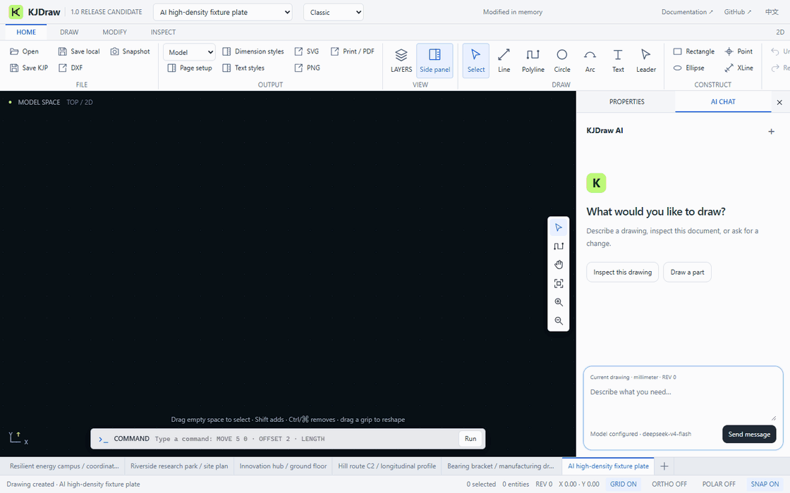
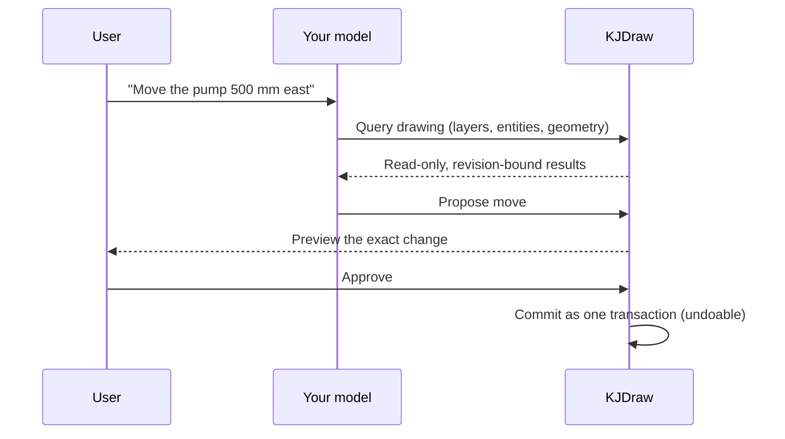

<div align="center">


# KJDraw

### The open-source CAD engine for the AI era

The model describes engineering intent. KJDraw compiles it into real CAD drawings<br/>
that stay editable, verifiable, undoable, and reopenable.

[**Quick start**](#-quick-start) · [**Try with AI**](https://kanjieteam.github.io/kjdraw/ai/) · [**Live editor**](https://kanjieteam.github.io/kjdraw/) · [**Docs**](https://kanjieteam.github.io/kjdraw/docs/latest/) · [**Contribute Skills**](docs/contributing-skills.md) · [简体中文](README.zh-CN.md)

[](https://github.com/KanJieTeam/kjdraw/releases)
[](https://www.npmjs.com/package/@kanjieteam/kjdraw)
[](LICENSE)

</div>

<p align="center">
  <a href="https://kanjieteam.github.io/kjdraw/">
    
  </a>
  <br/>
  <sub>Recorded in the built-in workbench; the Agent panel replays a preset scenario. To use KJDraw from a real AI client, see Quick start.</sub>
</p>

## Draw it. Then keep editing it.

KJDraw creates editable CAD objects, not a one-off picture. Ask your agent to draw a part, then change a hole diameter, move an object or revise a layer without starting over. Review each proposed change before applying it; undo, save and reopen the drawing when you need to.

**The model decides what to draw. KJDraw handles the CAD operations.**

## 🚀 Quick start

For Codex, Claude Code, Cursor and other terminal-enabled agents (Node.js 22+), run these once:

```sh
npm install -g @kanjieteam/kjdraw@next
npx skills add KanJieTeam/kjdraw -g
```

The first command installs the CAD engine; the second lets you choose which agent receives the Skill. Restart your agent, then ask:

```text
Use KJDraw to draw a circle with a radius of 5 mm.
```

Review the proposed change, approve it, then export the drawing as **DXF**. The Skill uses the local CAD engine; **MCP registration is optional**. [Approval and export guide](docs/try-in-ai.md#skill-first-local-cli).

Prefer not to install? [Try with AI](https://kanjieteam.github.io/kjdraw/ai/) in your browser and connect your model. Your requests and drawing context go to that provider; conversations, drawings and the key stay saved in this browser. Clear site data on shared devices. [Connection requirements and other agents](docs/try-in-ai.md).

## What you can build

| Workflow | Current scope |
| --- | --- |
| **Understand existing drawings** | Available: paged reads, spatial and property queries, stable IDs within a live/KJD document, layers, block references, topology and change-impact inspection for supported objects. DXF reimport may assign new internal IDs |
| **Generate engineering drawings** | Sample workflows: manufacturing parts, floor plans, site and utility plans, road alignments, borehole logs, geological sections and charts. Complete production workflows are still being validated |
| **Keep editing through conversation** | Available command subset: select, move, copy, rotate, scale, offset, stretch, lengthen, edit text, change layers and delete for supported objects and combinations; model-guided multi-turn tasks still need real-world validation |
| **Review and revise safely** | Available: revision-bound proposals, human approval, one-transaction changes, undo and save/reopen checks for the supported workflow |
| **Embed CAD in your product** | Available: TypeScript/JavaScript SDK, React and Vue components, packaged editor, CLI, MCP and local file workflows on the same engine |

## Is KJDraw right for you?

| ✅ Good fit | ⏳ Not a fit yet |
| --- | --- |
| You want an AI agent to generate and repeatedly revise engineering drawings | You need to open and save DWG directly |
| You're building an AI product that changes drawings, with a human in the loop | You need full desktop-CAD parity or 3D solid modeling |
| You need a CAD editor inside a web product (review, inspection, configurators, internal tools) | You need certified plotting or print output |
| You process DXF/KJD in scripts or CI, headless, with no upload | |

KJDraw is a CAD engine and execution layer. It is not trying to replace desktop CAD.

## 📦 Embed CAD in your app

Building a JavaScript or TypeScript app? Use the separate [SDK quickstart](https://kanjieteam.github.io/kjdraw/docs/latest/quickstart/) for project installation. You do not need the agent setup above. The embed API looks like this:

```html
<div id="cad" style="height: 720px"></div>
```

```ts
import { createKJDrawEditor } from '@kanjieteam/kjdraw/editor'

const editor = createKJDrawEditor('#cad', {
  document: 'sample',
  locale: 'en',
  theme: 'dark',
  layout: 'classic', // 'classic' | 'compact' | 'focus'
})

await editor.ready
// await editor.open(file)                              // a File from your file picker
// await editor.save({ format: 'DXF', download: true })
```

<details>
<summary><b>React</b></summary>

```tsx
import { KJDraw } from '@kanjieteam/kjdraw/react'

export default function DrawingPage() {
  return <KJDraw document="sample" locale="en" style={{ height: 720 }} />
}
```

</details>

<details>
<summary><b>Vue 3</b></summary>

```vue
<script setup lang="ts">
import { KJDraw } from '@kanjieteam/kjdraw/vue'
</script>

<template>
  <KJDraw document="sample" locale="en" style="height: 720px" />
</template>
```

</details>

[Quickstart](https://kanjieteam.github.io/kjdraw/docs/latest/quickstart/) · [React guide](https://kanjieteam.github.io/kjdraw/docs/latest/react/) · [Vue guide](https://kanjieteam.github.io/kjdraw/docs/latest/vue/) · [Runnable examples](packages/kjdraw-sdk/examples) · [API reference](https://kanjieteam.github.io/kjdraw/docs/latest/api/)

## 🤖 Build a CAD agent into your own product

Your app brings the model. KJDraw brings the CAD tools, the review step and the undo history.


```mermaid
sequenceDiagram
    participant U as User
    participant M as Your model
    participant K as KJDraw
    U->>M: "Move the pump 500 mm east"
    M->>K: Query drawing (layers, entities, geometry)
    K-->>M: Read-only, revision-bound results
    M->>K: Propose move
    K-->>U: Preview the exact change
    U->>K: Approve
    K->>K: Commit as one transaction (undoable)
```

Each proposal is bound to the revision it was made against, can be used only once, and commits as a single transaction that undoes like a manual edit.

- [Agent workflow guide](https://kanjieteam.github.io/kjdraw/docs/latest/agent/): call drawing tools, review a change and apply it
- [Connecting a model](https://kanjieteam.github.io/kjdraw/docs/latest/models/): the host owns transport, budgets and approval
- [Instructions for coding agents](docs/agent.md)
- [Command example](examples/agent-command.mjs): propose, approve and undo without a model or API key

## Formats and scope

Use **DXF** to exchange drawings with other CAD tools. KJD and KJP are optional native formats for KJDraw document and project state.

| Area | Status |
| --- | --- |
| **DXF** (ASCII) | ✅ Documented subset, R14–2024 version labels — [compatibility details](docs/dxf-compatibility.md) |
| Binary DXF | ❌ Not supported |
| **DWG** | ❌ Not in 1.0 — convert to DXF first (for example with ODA File Converter) |
| **KJD** native drawings | ✅ Read/write, validation, transactions, revisions, undo/redo |
| **KJP** projects | ✅ Multiple drawings in one package with snapshots, hashes and command journals |
| **3D** | 🧪 Experimental meshes, primitives and box booleans |
| CLI | ✅ Inspect, validate and convert KJD, KJP and DXF headless — [file guide](https://kanjieteam.github.io/kjdraw/docs/latest/files/) |

Unsupported content is rejected rather than silently dropped. Full boundaries: [release status](docs/status.md) · [1.0 scope](docs/1.0-scope.md).

## Contributing

**Contribute a Skill for your industry.** Start with the [Skill catalog](skills/README.md) and [developer guide](docs/contributing-skills.md). An industry pack is one `skills/kjdraw-<industry-task>/` directory containing a workflow and any useful templates, rules or helpers.

**Fork → add `skills/kjdraw-<topic>/` → test your workflow → open a PR.**

[Skill developer guide](docs/contributing-skills.md) · [Skill catalog and samples](skills/README.md) · [All contribution types](CONTRIBUTING.md) · [中文技能包指南](docs/contributing-skills.zh-CN.md).

Define the inputs, outputs and acceptance checks. Reusing existing operations normally does not require a kernel change; propose missing planner, plugin or engine capabilities separately.

For a new Skill, include `SKILL.md` and a human README in **English or Chinese**; maintainers can help with the translation. Add a focused `tests/community-<topic>.spec.mjs`, then run one command from the repository root:

```sh
npm run check:skill
```

This checks package structure and runs workflow tests with public synthetic inputs; it does not certify model behavior. To check only your pack, append `-- skills/kjdraw-your-topic`. List the Skill in [the catalog](skills/README.md).

The most useful contributions right now:

- **An installable domain Skill.** Start from [read-only text audit](skills/kjdraw-text-audit/README.md), [mechanical hole patterns](skills/kjdraw-hole-pattern/README.md) or [drawing templates and layer rules](skills/kjdraw-sheet-template/README.md); keep its own short `SKILL.md` and useful resources, and add tests for your actual workflow.
- **A reproducible drawing problem.** Share a small synthetic DXF or a reduced example you are authorized to publish, with the request and expected result. Do not upload private customer drawings.
- **A reusable engineering workflow.** Explicit inputs, editable CAD output, and tests for changes, undo and DXF reopening. Start from the [domain planner example](examples/domain-planner-starter/README.md).
- **Try it in your AI client and report back**, especially failed generations or multi-turn edits that go wrong.
- **Editing tools, drawing types, performance, accessibility and docs.**

```bash
git clone https://github.com/KanJieTeam/kjdraw.git
cd kjdraw
npm ci --ignore-scripts
npm run dev          # http://localhost:4173
```

Open the editor at <http://localhost:4173>. For a Skill-only PR, use `npm run check:skill`; SDK or UI changes also need the checks in [Contributing](CONTRIBUTING.md). Choose a task from the [industry-pack claim list](docs/industry-skill-tasks.md) and [claim it here](https://github.com/KanJieTeam/kjdraw/issues/4), or propose your own. See [Governance](GOVERNANCE.md) · [Roadmap](docs/roadmap.md) · [Support](SUPPORT.md).

## Star History

[](https://www.star-history.com/#KanJieTeam/kjdraw&Date)

---

<div align="center">

If KJDraw is useful to you, a ⭐ helps other engineers find it.

Built by [KanJieTeam](https://github.com/KanJieTeam), open to contributors everywhere · [kanjieteam@163.com](mailto:kanjieteam@163.com) · [Apache-2.0](LICENSE)

</div>
