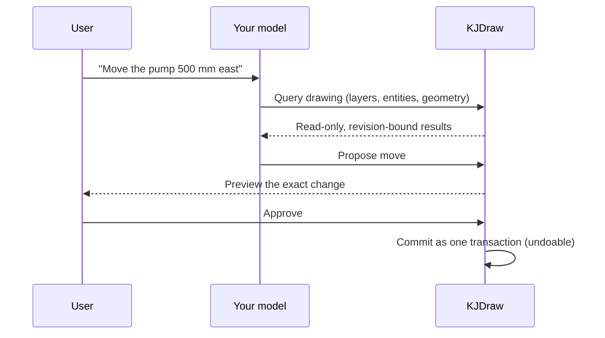

<div align="center">


# KJDraw

### The open-source CAD engine for the AI era

The model describes engineering intent. KJDraw compiles it into real CAD drawings<br/>
that stay editable, verifiable, undoable, and reopenable.

<!-- TODO: confirm in a browser that /ai/ opens the AI page, not the plain editor -->
[**Quick start**](#-quick-start) · [**Try with AI**](https://kanjieteam.github.io/kjdraw/ai/) · [**Live editor**](https://kanjieteam.github.io/kjdraw/) · [**Docs**](https://kanjieteam.github.io/kjdraw/docs/latest/) · [简体中文](README.zh-CN.md)

[](https://github.com/KanJieTeam/kjdraw/releases)
[](https://www.npmjs.com/package/@kanjieteam/kjdraw)
[](LICENSE)

</div>

<!-- TODO (most important): replace this GIF with a 15–30 s recording in a real AI client:
     one sentence → drawing appears → one follow-up edit → drawing updates → Undo.
     Then delete the "preset scenario" sentence in the caption. -->
<p align="center">
  <a href="https://kanjieteam.github.io/kjdraw/">
    
  </a>
  <br/>
  <sub>Recorded in the built-in workbench; the Agent panel replays a preset scenario. To use KJDraw from a real AI client, see Quick start.</sub>
</p>

## Built for the next edit

Generating something that looks like CAD is no longer hard. Engineering CAD means keeping hundreds of related objects correct across a long conversation: finding the same object again, preserving dimensions, layers, blocks, hatches and references, and getting a consistent result after Undo, export, save and reopen.

Asking an LLM to emit coordinates and primitives one by one burns tokens, lets geometry drift, and leaves later turns guessing which object to change.

KJDraw gives any model or agent the same CAD execution layer: **the model decides what to draw; the engine makes sure it is drawn correctly.** Geometry, object identity, layers, references, transactions, validation and file output are handled deterministically by a local engine — and when key data is missing, it refuses instead of guessing.

## 🚀 Quick start

**Use KJDraw from an AI agent.** The `kjdraw-cad` Skill can be installed in Codex, Claude Code, Cursor and other terminal-capable agents. The new `kjdraw agent` CLI lets that Skill inspect drawings and create review proposals locally; **MCP registration is optional**. The CLI-bearing npm release is pending, so use the [source-checkout instructions](docs/try-in-ai.md#skill-first-local-cli) to test this path today.

The current one-line installer is the existing MCP route and uses a pinned release channel that can lag the source candidate. The source candidate configures **Kimi Code, WorkBuddy, ZCode, Claude Code and Cursor**; **TraeCode** uses an import confirmation. These source-candidate additions have not yet been promoted to the public installer. Your model API key stays in your AI client.

**Windows PowerShell**

```powershell
irm https://raw.githubusercontent.com/KanJieTeam/kjdraw/main/scripts/install-ai.ps1 | iex
```

**macOS / Linux**

```bash
curl -fsSL https://raw.githubusercontent.com/KanJieTeam/kjdraw/main/scripts/install-ai.sh | sh
```

The portable Skill can be distributed with `npx skills add`, but **installing instructions alone does not install the CAD engine**. See [Skill-first setup and optional MCP](docs/try-in-ai.md).

Then ask your AI client:

```text
Use KJDraw to draw a circle with a radius of 5 mm.
```

The existing MCP installer can produce independently verified KJD/DXF candidates and SVG previews without overwriting the source. The new local CLI returns a proposal first; a human reviews it before KJD/DXF candidates are written. [Installation details and security model](docs/try-in-ai.md)

> **1.0 release candidate:** command-line setup and real-engine smoke tests pass; independent GUI and live-model acceptance for each client is still in progress.

## What you can build

| Workflow | What works today |
| --- | --- |
| **Understand existing drawings** | Paged reads, spatial and property queries, stable IDs, layers, block references, topology and change-impact inspection |
| **Generate engineering drawings** | High-level compilers for manufacturing parts, floor plans, site and utility plans, road alignments, borehole logs, geological sections and charts |
| **Keep editing through conversation** | Select precisely, then move, copy, rotate, scale, offset, stretch, lengthen, edit text, change layers, and delete with relationships rebuilt |
| **Deterministic quality loop** | Every run checks geometry, layers, references and revision; each change is one undoable transaction you can save, reopen and re-verify |
| **Embed CAD in your product** | TypeScript/JavaScript SDK, React and Vue components, packaged editor, CLI, MCP and local file workflows — all on the same engine |

## Is KJDraw right for you?

| ✅ Good fit | ⏳ Not a fit yet |
| --- | --- |
| You want an AI agent to generate and repeatedly revise engineering drawings | You need to open and save DWG directly |
| You're building an AI product that changes drawings, with a human in the loop | You need full desktop-CAD parity or 3D solid modeling |
| You need a CAD editor inside a web product (review, inspection, configurators, internal tools) | You need certified plotting or print output |
| You process DXF/KJD in scripts or CI, headless, with no upload | |

KJDraw is a CAD engine and execution layer. It is not trying to replace desktop CAD.

## 📦 Add CAD to your app

```bash
npm install @kanjieteam/kjdraw@next
```

<!-- Once npm `latest` points to 1.0.0-rc.3 or newer, switch to `npm install @kanjieteam/kjdraw` and delete the note below. -->
> As of 2026-09-28, npm `next` still resolves to `1.0.0-rc.2`. The example below reflects the `1.0.0-rc.3` source candidate and may not work with `@next` until it is published. See [release status](docs/status.md) and [source installation](https://kanjieteam.github.io/kjdraw/docs/latest/installation/).

```html
<div id="cad" style="height: 720px"></div>
```

```ts
import { createKJDrawEditor } from '@kanjieteam/kjdraw/editor'

const editor = createKJDrawEditor('#cad', {
  document: 'sample',
  locale: 'en',
  theme: 'dark',
  layout: 'classic', // 'classic' | 'compact' | 'focus'
})

await editor.ready
// await editor.open(file)                              // a File from your file picker
// await editor.save({ format: 'DXF', download: true })
```

<details>
<summary><b>React</b></summary>

```tsx
import { KJDraw } from '@kanjieteam/kjdraw/react'

export default function DrawingPage() {
  return <KJDraw document="sample" locale="en" style={{ height: 720 }} />
}
```

</details>

<details>
<summary><b>Vue 3</b></summary>

```vue
<script setup lang="ts">
import { KJDraw } from '@kanjieteam/kjdraw/vue'
</script>

<template>
  <KJDraw document="sample" locale="en" style="height: 720px" />
</template>
```

</details>

[Quickstart](https://kanjieteam.github.io/kjdraw/docs/latest/quickstart/) · [React guide](https://kanjieteam.github.io/kjdraw/docs/latest/react/) · [Vue guide](https://kanjieteam.github.io/kjdraw/docs/latest/vue/) · [Runnable examples](packages/kjdraw-sdk/examples) · [API reference](https://kanjieteam.github.io/kjdraw/docs/latest/api/)

## 🤖 Build a CAD agent into your own product

Your app brings the model. KJDraw brings the CAD tools, the review step and the undo history.


```mermaid
sequenceDiagram
    participant U as User
    participant M as Your model
    participant K as KJDraw
    U->>M: "Move the pump 500 mm east"
    M->>K: Query drawing (layers, entities, geometry)
    K-->>M: Read-only, revision-bound results
    M->>K: Propose move
    K-->>U: Preview the exact change
    U->>K: Approve
    K->>K: Commit as one transaction (undoable)
```

Each proposal is bound to the revision it was made against, can be used only once, and commits as a single transaction that undoes like a manual edit.

- [Agent workflow guide](https://kanjieteam.github.io/kjdraw/docs/latest/agent/): call drawing tools, review a change and apply it
- [Connecting a model](https://kanjieteam.github.io/kjdraw/docs/latest/models/): the host owns transport, budgets and approval
- [Instructions for coding agents](docs/agent.md)
- [Command example](examples/agent-command.mjs): propose, approve and undo without a model or API key

## Formats and scope

| Area | Status |
| --- | --- |
| **KJD** native drawings | ✅ Read/write, validation, transactions, revisions, undo/redo |
| **KJP** projects | ✅ Multiple drawings in one package with snapshots, hashes and command journals |
| **DXF** (ASCII) | ✅ Documented subset, R14–2024 version labels — [compatibility details](docs/dxf-compatibility.md) |
| Binary DXF | ❌ Not supported |
| **DWG** | ❌ Not in 1.0 — convert to DXF first (for example with ODA File Converter) |
| **3D** | 🧪 Experimental meshes, primitives and box booleans |
| CLI | ✅ Inspect, validate and convert KJD, KJP and DXF headless — [file guide](https://kanjieteam.github.io/kjdraw/docs/latest/files/) |

Unsupported content is rejected rather than silently dropped. Full boundaries: [release status](docs/status.md) · [1.0 scope](docs/1.0-scope.md).

## Contributing

**Our mission: make KJDraw the default open-source CAD engine for the AI era.**

The most useful contributions right now:

- **A drawing that breaks KJDraw.** Real DXF files that fail to open or render correctly are the fastest way to improve compatibility.
- **Try it in your AI client and report back**, especially failed generations or multi-turn edits that go wrong.
- **Editing tools, drawing types, performance, accessibility and docs.**

```bash
git clone https://github.com/KanJieTeam/kjdraw.git
cd kjdraw
npm ci --ignore-scripts
npm run dev          # http://localhost:4173
```

Before opening a PR, run `npm run typecheck` and `npm test` (plus `npm run test:browser` for UI changes). For larger changes, please [open an issue](https://github.com/KanJieTeam/kjdraw/issues) first. See [Contributing](CONTRIBUTING.md) · [Governance](GOVERNANCE.md) · [Roadmap](docs/roadmap.md) · [Support](SUPPORT.md).

## Star History

[](https://www.star-history.com/#KanJieTeam/kjdraw&Date)

---

<div align="center">

If KJDraw is useful to you, a ⭐ helps other engineers find it.

Built by [KanJieTeam](https://github.com/KanJieTeam), open to contributors everywhere · [kanjieteam@163.com](mailto:kanjieteam@163.com) · [Apache-2.0](LICENSE)

</div>
