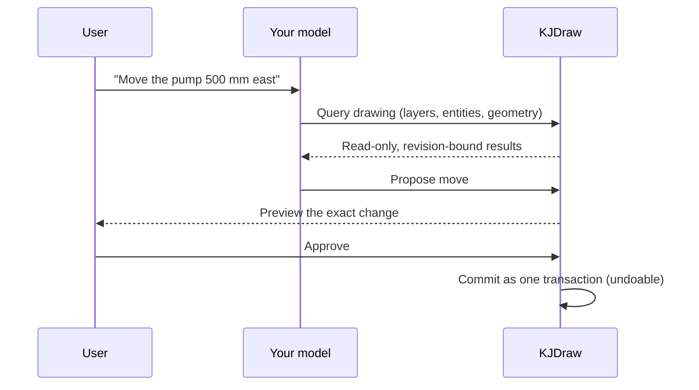

<div align="center">


# KJDraw

### The open-source CAD engine for AI agents

Let an AI model edit real engineering drawings — every change is previewed,<br/>
approved by a person, and undoable. Or drop the full editor into your web app with one component.

[**▶ Try the editor**](https://kanjieteam.github.io/kjdraw/) · [**Docs**](https://kanjieteam.github.io/kjdraw/docs/latest/) · [**Agent guide**](https://kanjieteam.github.io/kjdraw/docs/latest/agent/) · [简体中文](README.zh-CN.md)

[](https://github.com/KanJieTeam/kjdraw/releases)
[](https://www.npmjs.com/package/@kanjieteam/kjdraw)
[](LICENSE)

</div>

<!-- TODO（最重要）：用真实模型录一段 15 秒 GIF 替换下面这张。
     建议脚本：输入「画一块 100×60 的安装板，四角开 M8 孔，标注尺寸」→ 出现预览 diff → 点击批准 → 图纸更新 → Ctrl+Z 撤销。
     录好后删掉下方说明里 “preset scenario” 那句。 -->
<p align="center">
  <a href="https://kanjieteam.github.io/kjdraw/">
    
  </a>
  <br/>
  <sub>Recorded in the built-in workbench. The Agent panel replays a preset scenario — connect your own model with the <a href="#-give-your-agent-cad-tools">agent tools</a>.</sub>
</p>

<p align="center"><b>No sign-up. Files open in your browser and never get uploaded.</b></p>

---

## Why KJDraw

**🤖 Agent edits you can trust.** An agent can read the drawing and propose changes, but nothing touches the document until a person approves the exact diff. Each proposal is bound to the document revision it was made against, can be used only once, and commits as a single transaction that undoes like a manual edit.

**📐 A real CAD editor, not a viewer.** Lines, polylines, arcs, text, dimensions and layers; move, copy, rotate, offset, arrays, trim/extend, fillet/chamfer; snapping, grips and full undo/redo. Save to native KJD/KJP or DXF.

**🧩 Embeds anywhere, stays local.** One component for vanilla JS, React or Vue. TypeScript throughout, with an optional Rust/WASM core. Browser-local by default — no backend, no analytics.

## 🤖 Give your agent CAD tools

Your app brings the model. KJDraw brings the tools, the review step and the undo history.


```mermaid
sequenceDiagram
    participant U as User
    participant M as Your model
    participant K as KJDraw
    U->>M: "Move the pump 500 mm east"
    M->>K: Query drawing (layers, entities, geometry)
    K-->>M: Read-only, revision-bound results
    M->>K: Propose move
    K-->>U: Preview the exact change
    U->>K: Approve
    K->>K: Commit as one transaction (undoable)
```

- **Model-neutral.** Built-in adapters for several model APIs, plus a custom interface for anything else.
- **Starter toolset today:** query entities and layers, measure, create lines and circles, move objects. More tools are on the roadmap — [contributions welcome](#contributing).
- **Try it without an API key:** clone the repo and run the [command example](examples/agent-command.mjs), which walks through propose → approve → undo.
  <!-- TODO：确认下面这条命令在 npm ci 之后可以直接运行 -->
  ```bash
  node examples/agent-command.mjs
  ```

[Agent workflow guide](https://kanjieteam.github.io/kjdraw/docs/latest/agent/) · [Connecting a model](https://kanjieteam.github.io/kjdraw/docs/latest/models/) · [Instructions for coding agents](docs/agent.md)

<!-- 建议：做一个 MCP server（npx 一行启动），做好后在这里加一节 “Use with Claude Desktop / Cursor”，这会是最强的传播点。 -->

## 📦 Add CAD to your app

```bash
npm install @kanjieteam/kjdraw@next
```

<!-- 等 npm 的 latest 标签指向 1.0.0-rc.3 或更新版本后，把上面改成 npm install @kanjieteam/kjdraw，并删掉下面这句。 -->
> As of 2026-09-28, npm `next` still resolves to `1.0.0-rc.2`. The example below reflects the `1.0.0-rc.3` source candidate and may not work with `@next` until it is published. See [release status](docs/status.md) and [source installation](https://kanjieteam.github.io/kjdraw/docs/latest/installation/).

```html
<div id="cad" style="height: 720px"></div>
```

```ts
import { createKJDrawEditor } from '@kanjieteam/kjdraw/editor'

const editor = createKJDrawEditor('#cad', {
  document: 'sample',
  locale: 'en',
  theme: 'dark',
  layout: 'classic', // 'classic' | 'compact' | 'focus'
})

await editor.ready
// await editor.open(file)                              // a File from your file picker
// await editor.save({ format: 'DXF', download: true })
```

<details>
<summary><b>React</b></summary>

```tsx
import { KJDraw } from '@kanjieteam/kjdraw/react'

export default function DrawingPage() {
  return <KJDraw document="sample" locale="en" style={{ height: 720 }} />
}
```

</details>

<details>
<summary><b>Vue 3</b></summary>

```vue
<script setup lang="ts">
import { KJDraw } from '@kanjieteam/kjdraw/vue'
</script>

<template>
  <KJDraw document="sample" locale="en" style="height: 720px" />
</template>
```

</details>

[Quickstart](https://kanjieteam.github.io/kjdraw/docs/latest/quickstart/) · [React guide](https://kanjieteam.github.io/kjdraw/docs/latest/react/) · [Vue guide](https://kanjieteam.github.io/kjdraw/docs/latest/vue/) · [Runnable examples](packages/kjdraw-sdk/examples) · [API reference](https://kanjieteam.github.io/kjdraw/docs/latest/api/)

## Is KJDraw right for you?

| ✅ Good fit | ⏳ Not a fit yet |
| --- | --- |
| You're building an AI assistant that needs to change drawings, with a human in the loop | You need to open and save DWG directly |
| You need a CAD editor inside a web product (inspection, review, configurators, internal tools) | You need full desktop-CAD parity or 3D solid modeling |
| You process DXF/KJD files in scripts or CI, headless, with no upload | You need certified plotting or print output |

KJDraw is an engine for building products and agent workflows. It is not trying to replace desktop CAD.

## What works today

| Area | Status |
| --- | --- |
| **KJD** native drawings | ✅ Read/write, validation, transactions, revisions, undo/redo |
| **KJP** projects | ✅ Multiple drawings in one package with snapshots, hashes and command journals |
| **DXF** (ASCII) | ✅ Documented subset, R14–2024 version labels — [compatibility details](docs/dxf-compatibility.md) |
| Binary DXF | ❌ Not supported |
| **DWG** | ❌ Not in 1.0 — convert to DXF first (for example with ODA File Converter) |
| **3D** | 🧪 Experimental meshes, primitives and box booleans |
| Headless CLI | ✅ Inspect, validate and convert KJD, KJP and DXF — [file guide](https://kanjieteam.github.io/kjdraw/docs/latest/files/) |

Unsupported content is rejected rather than silently dropped. Full boundaries: [release status](docs/status.md) · [1.0 scope](docs/1.0-scope.md).

## Contributing

**Our goal: make KJDraw the default open-source CAD engine for the AI era.**

The most useful contributions right now:

- **A drawing that breaks KJDraw.** Real DXF files that fail to open or render correctly are the fastest way to improve compatibility.
- **New agent tools** and agent examples.
- **Editing tools**, performance, accessibility and docs.

```bash
git clone https://github.com/KanJieTeam/kjdraw.git
cd kjdraw
npm ci --ignore-scripts
npm run dev          # http://localhost:4173
```

Before opening a PR, run `npm run typecheck` and `npm test` (plus `npm run test:browser` for UI changes). For larger changes, please [open an issue](https://github.com/KanJieTeam/kjdraw/issues) first. See [CONTRIBUTING](CONTRIBUTING.md) · [Governance](GOVERNANCE.md) · [Roadmap](docs/roadmap.md).

---

<div align="center">

If KJDraw is useful to you, a ⭐ helps other engineers find it.

Built by [KanJieTeam](https://github.com/KanJieTeam) · [kanjieteam@163.com](mailto:kanjieteam@163.com) · [Apache-2.0](LICENSE)

</div>
