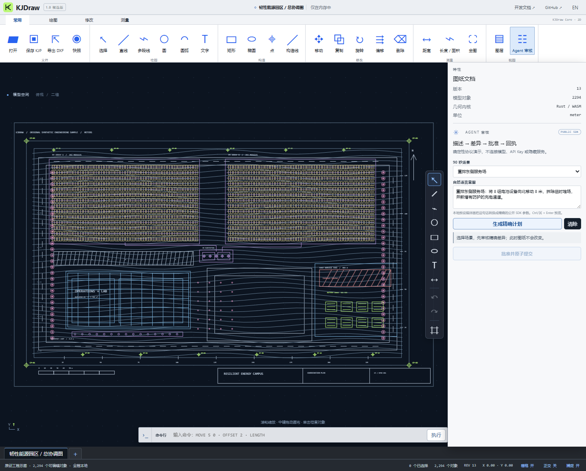

<p align="center"></p>

<p align="center">
  <a href="https://github.com/KanJieTeam/kjdraw/actions/workflows/ci.yml"></a>
  <a href="https://www.npmjs.com/package/@kanjieteam/kjdraw"></a>
  <a href="https://www.npmjs.com/package/@kanjieteam/kjdraw"></a>
  <a href="LICENSE"></a>
  <a href="https://kanjieteam.github.io/kjdraw/"></a>
  <a href="https://kanjieteam.github.io/kjdraw/docs/latest/"></a>
</p>

<p align="center"><strong>面向工程软件与 AI Agent 的可编程 CAD 基础设施。</strong><br>TypeScript 优先，Rust/WASM 加速，浏览器即用，部署方式由宿主选择。</p>

<p align="center"><a href="https://kanjieteam.github.io/kjdraw/"><strong>打开在线工作台</strong></a> · <a href="https://kanjieteam.github.io/kjdraw/docs/latest/"><strong>阅读文档</strong></a> · <a href="https://kanjieteam.github.io/kjdraw/docs/latest/api/"><strong>API 参考</strong></a> · <a href="#安装并开始绘图">安装</a> · <a href="README.md">English</a></p>



KJDraw 把 CAD 从封闭的桌面界面变成可嵌入、强类型、可审核的工程基础。你可以把无界面 SDK 嵌入 Web 或 Node.js 产品，从参考工作台继续开发，用插件扩展能力，也可以让 AI Agent 与人类共用同一套事务命令边界。

它源于 **勘界 Kanjie** 的真实产品需求，但公共核心刻意保持通用。专业成图编译器、客户数据、行业知识与商业服务继续独立；可以复用的 CAD 改进优先回到这里，避免开源与产品重复开发。

## 一次看完整工作流

在线工作台默认打开一张包含两千多个图元的原创合成工程图。一次体验即可完成：

1. 检查图层和对象，绘制与编辑几何，捕捉、测量并撤销。
2. 用自然语言描述修改，在图档真正变化前检查移动、删除、新增的精确差异。
3. 人工批准一次原子事务，并查看回执、版本号和内容绑定。
4. 下载 KJP 工程，按指纹重开验证，然后撤销整次变更。

演示无需账号、后端、模型密钥或上传图纸。Agent 流程采用确定性示例，便于任何人复现安全边界；实际大模型由你的宿主应用接入。

**[90 秒体验完整流程 →](https://kanjieteam.github.io/kjdraw/)**

## 安装并开始绘图

```sh
npm install @kanjieteam/kjdraw
```

```ts
import {
  createKJDrawSDK,
  type KJReadonlyObjectRecord,
} from '@kanjieteam/kjdraw'

const cad = createKJDrawSDK()
const drawing = cad.createDocument({
  documentId: 'site-plan',
  units: 'millimeter',
})

const line = await cad.executeCommand<KJReadonlyObjectRecord>('CREATE', {
  type: 'LINE',
  payload: { start: [0, 0, 0], end: [100, 40, 0] },
})

await cad.executeCommand('MOVE', { id: line.id, dx: 25, dy: 10 })
console.log(drawing.revision, drawing.fingerprint())
```

npm 包采用 ESM，运行时零依赖；根入口和子路径覆盖文档、几何、文件适配器、部署 Provider、工程、插件和 Agent 计划，并由自动生成的类型声明与 API 文档约束。

### Vanilla、React、Vue 与 CLI

| 从这里开始 | 你会看到什么 |
| --- | --- |
| [Vanilla 快速示例](packages/kjdraw-sdk/examples/quickstart.mjs) | 使用包 API 创建、编辑与检查图档 |
| [React Hook](packages/kjdraw-sdk/examples/react.tsx) | 稳定 SDK 生命周期、类型化事件和组件清理 |
| [Vue Composable](packages/kjdraw-sdk/examples/vue.ts) | 响应式图档状态与作用域释放 |
| [插件起步工程](examples/plugin-starter/README.md) | 清单兼容、权限授权、激活与完整卸载 |

包内还提供纯本地无界面 CLI：

```sh
npx @kanjieteam/kjdraw inspect drawing.dxf
npx @kanjieteam/kjdraw validate project.kjp
npx @kanjieteam/kjdraw convert drawing.kjd drawing.dxf --dxf-version 2018
```

## 为真实工程产品准备的基础

| 层 | 公共 1.0 合同 |
| --- | --- |
| **文档模型** | 稳定 ID 与 CAD 句柄、所有权、表、块、模型/图纸空间、资源与修订 |
| **编辑** | 原子事务、回滚、撤销/重做、期望版本、选择、捕捉和已声明二维操作 |
| **文件与工程** | KJD 图档、确定性 ZIP64 KJP 工程及有明确边界的 ASCII DXF 兼容范围 |
| **通用工作台** | 完全基于公共包 API 构建的中英文多图纸 CAD 界面 |
| **扩展机制** | 版本化插件清单，以及命令、实体、渲染、文件、工具、捕捉、属性和工作区扩展点 |
| **AI Agent** | 审核计划、精确参数、SHA-256 内容绑定、过期、一次性执行、回执与撤销 |
| **内核** | 可重建 Rust/WASM 文档权威层、几何判定和明确受限的实体网格运算 |
| **部署** | 浏览器本地默认；桌面、私有化、云增强和混合产品可显式挂接工程、计算与场景 Provider |

```text
你的产品 · 参考工作台 · 插件 · AI Agent
                    │
              命令 + 原子事务
                    │
       类型化文档模型 + KJD / KJP / DXF
                    │
       TypeScript SDK ↔ 可选 Rust / WASM
                    │
    浏览器本地 · 桌面 · 私有化 · 云增强
```

KJDraw 不把架构限制为“只能本地”。公共演示在浏览器内处理图纸；嵌入应用可以明确注册远程 Provider。仅注册 Provider 不会自行产生网络请求。

## Agent 修改不是黑盒操作

AI 发起的命令不能偷偷复用旧批准。SDK 将审核计划绑定到精确参数、图档身份、完整内容摘要、指纹、期望版本、有效期和审核人；并发重放和图档漂移会关闭执行。批准后的变更仍进入普通事务历史，可以撤销。

```text
意图 → 不可变提案 → 可视差异 → 人工批准
     → 一次原子命令 → 回执 → 保存 / 重开 / 撤销
```

这是应用协议，不是用户身份系统或恶意代码沙箱。身份认证、授权、模型隔离和持久审计仍由宿主负责。详见 [Agent 协议](docs/agent-protocol.md)和[安全架构](SECURITY_ARCHITECTURE.md)。

## 文件互操作，拒绝夸大承诺

| 格式 | KJDraw 的公开承诺 |
| --- | --- |
| **KJD** | 可校验、带修订的规范事务图档格式 |
| **KJP** | 多图纸 ZIP64 工程、清单、哈希、快照与命令日志 |
| **DXF** | 公开实体/资源/版本范围内的 ASCII 导入导出，并提供语料和跨工具审计 |
| **DWG** | 不属于 KJDraw 1.0 |

已知无法导出的语义应明确拒绝，而不是冒充无损。评估互操作时请保留原文件。参见 [DXF 证据](docs/dxf-compatibility.md)、[能力矩阵](docs/capability-matrix.md)与[当前状态](docs/status.md)。

## 1.0 合同

`1.0.0-rc.1` 是稳定合同的不可变候选版。只有所有范围内验收项在这条候选线上通过，并验证 npm 打包产物、浏览器矩阵、在线 Demo/Docs 和发布来源证明，才会晋级稳定版。

KJDraw 1.0 明确不承诺 DWG、任意 DXF 无损转换、通用 BRep、完整参数化约束、完整字体/布局保真、实时协作和设备认证打印。实验性实体网格会继续标明实验属性。

参见 [1.0 产品边界](docs/1.0-scope.zh-CN.md)、[机器可读验收矩阵](docs/KJDRAW_1_0_ACCEPTANCE_MATRIX.json)和[候选版说明](docs/releases/1.0.0-rc.1.md)。

## 本地运行与参与贡献

```sh
git clone https://github.com/KanJieTeam/kjdraw.git
cd kjdraw
npm ci --ignore-scripts
npm run typecheck
npm test
npm run build
npm run test:browser
```

运行 `node scripts/serve.mjs` 后访问 **http://localhost:4173**。公开 Issue 只应使用合成数据或明确可再分发的图纸。

欢迎提交可复现 DXF 案例、几何修复、插件、框架集成、无障碍改进和文档。请先阅读[贡献指南](CONTRIBUTING.md)、[治理规则](GOVERNANCE.md)、[支持政策](SUPPORT.md)与[路线图](docs/roadmap.md)。

**由 [KanJieTeam](https://github.com/KanJieTeam) 维护** · [kanjieteam@163.com](mailto:kanjieteam@163.com) · Apache-2.0

Apache 许可覆盖本仓库，不覆盖勘界私有数据、专业领域包、商业服务或第三方 CAD 资产。详见 [LICENSE](LICENSE)、[NOTICE](NOTICE)与[来源说明](docs/provenance.md)。
