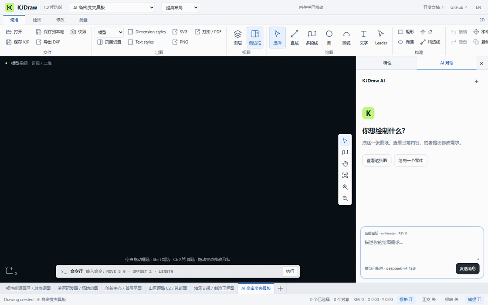

<p align="center"></p>

<h1 align="center">KJDraw</h1>

<p align="center"><strong>面向工程应用与AI智能体的CAD基础设施。</strong></p>

<p align="center">开源CAD引擎，以及开箱即用的编辑器。<br>创建、编辑和自动化工程图纸——用代码、用智能体，或亲手绘制。</p>

<p align="center"><strong>我们的目标：一句话、几个需求，让 AI 自动画出复杂、完整的 CAD 图纸。</strong></p>

<p align="center">
  <a href="https://kanjieteam.github.io/kjdraw/"><strong>在线体验</strong></a> ·
  <a href="#接入你的应用"><strong>接入你的应用</strong></a> ·
  <a href="#给你的-agent-配上-cad-工具"><strong>构建 CAD Agent</strong></a> ·
  <a href="README.md">English</a>
</p>

<p align="center">
  <a href="https://github.com/KanJieTeam/kjdraw/releases"></a>
  <a href="https://www.npmjs.com/package/@kanjieteam/kjdraw"></a>
  <a href="https://kanjieteam.github.io/kjdraw/docs/latest/"></a>
  <a href="LICENSE"></a>
</p>

<p align="center"><a href="https://kanjieteam.github.io/kjdraw/"></a></p>

<p align="center"><sub>真实工作台录制：浏览图纸、审核预设修改，再从空白绘制零件并标注尺寸。当前 Agent 场景使用预设流程，未连接语言模型。</sub></p>

## 从几个需求，到一张完整图纸

说清你需要什么，AI 自动完成后续绘制，交付包含可编辑图形、尺寸标注、图层和布局的复杂工程图纸。继续对话提出修改，就在同一份 CAD 图档上接着完成。这是 KJDraw 正在实现的核心体验。

架构围绕这条流程推进：**理解需求 → 拆解图纸 → 逐部件绘制与校验 → 自动纠错 → 交付通过验证的图纸**。持续保存的绘图工作区、面向当前任务的局部上下文、可复用 CAD 操作和独立几何校验共同支撑这一过程。完成意味着满足要求中的几何与关系约束、保留可编辑对象，并通过保存重开与出图检查。

**当前进度：**已实现有范围和预算限制的图纸查询、几何提案、预览、宿主审核和撤销重做。复杂完整图纸的自主交付仍在开发，上方动图展示的是当前编辑器能力。[1.0 开发计划](docs/product/1.0-delivery-plan.zh-CN.md)持续记录剩余工作与验收要求。

## 为什么选择 KJDraw？

- **让 AI Agent 真正用上 CAD。** 通过接口读取图形对象、调用绘图命令，并审核拟执行的修改。
- **接入 CAD，不必从零搭建编辑器。** 将绘图工具、图层、特性和文件操作直接接入 JavaScript、React 或 Vue 应用。
- **直接使用编辑器，也能扩展底层能力。** 使用现成界面、调整工作区，或者基于 CAD 引擎开发自己的工具。

## 在线体验

[打开在线编辑器](https://kanjieteam.github.io/kjdraw/)，无需注册或上传文件即可体验样例。

1. 选择机械详图、建筑平面、场地总图或道路纵断面。
2. 选中并移动对象、查看图层，或者从空白开始画一个零件。
3. 撤销一次修改，保存图纸，再打开继续编辑。

内置示例用于体验，不作为施工图使用。[工作台操作指南](https://kanjieteam.github.io/kjdraw/docs/latest/workbench/)提供绘图、选择、标注与保存说明。

## 接入你的应用

安装候选版：

```sh
npm install @kanjieteam/kjdraw@next
```

以下示例需要 **1.0.0-rc.3 或更新版本**。请使用 `next` 渠道，`latest` 可能较旧。已发布版本及尚未发布到 npm 的源码更新，详见[版本状态](docs/status.md)。

### JavaScript / TypeScript

准备一个有高度的容器：

```html
<div id="cad" style="height: 720px"></div>
```

```ts
import { createKJDrawEditor } from '@kanjieteam/kjdraw/editor'

const editor = createKJDrawEditor('#cad', {
  document: 'sample',
  locale: 'zh-CN',
  theme: 'dark',
  layout: 'classic',
})

await editor.ready
// await editor.open(file) // 来自文件选择框的 File
// await editor.save({ format: 'DXF', download: true })
```

### React

在已有的 React 应用中使用：

```tsx
import { KJDraw } from '@kanjieteam/kjdraw/react'

export default function DrawingPage() {
  return <KJDraw document="sample" locale="zh-CN" style={{ height: 720 }} />
}
```

### Vue

在已有的 Vue 3 应用中使用：

```vue
<script setup lang="ts">
import { KJDraw } from '@kanjieteam/kjdraw/vue'
</script>

<template>
  <KJDraw document="sample" locale="zh-CN" style="height: 720px" />
</template>
```

按需要选择**经典、紧凑或专注布局**。切换布局保留当前图纸和撤销记录。

[快速开始](https://kanjieteam.github.io/kjdraw/docs/latest/quickstart/) · [React 指南](https://kanjieteam.github.io/kjdraw/docs/latest/react/) · [Vue 指南](https://kanjieteam.github.io/kjdraw/docs/latest/vue/) · [可运行示例](packages/kjdraw-sdk/examples)

## 给你的 Agent 配上 CAD 工具

你的应用负责接入 AI 模型，KJDraw 提供 CAD 工具。Agent 可以调用接口创建和修改图形；支持预览的操作可交给用户检查、确认后再应用。修改结果仍可继续编辑或撤销。

例如，你的 Agent 应用可以把“移动选中的设备”转成一次待确认的移动操作，让用户批准后应用到当前图纸。批准后的修改和手动编辑一样，可以撤销。

- [构建 Agent 工作流](https://kanjieteam.github.io/kjdraw/docs/latest/agent/)：调用绘图工具，检查修改并应用。
- [Agent 接入说明](docs/agent.md)：供编程 Agent 使用的接入指南。
- [运行命令示例](examples/agent-command.mjs)：无需模型或 API Key，即可验证提议修改、批准和撤销。

## 文件与自动化

无需 AI 模型，也可以通过代码或命令行读取、编辑和保存图纸。用法见[文件指南](https://kanjieteam.github.io/kjdraw/docs/latest/files/)。

KJDraw 支持原生 KJD 图纸、KJP 工程，以及有明确[兼容范围的 DXF](docs/dxf-compatibility.md)。当前不支持直接打开 DWG。

## 参与贡献

**我们的使命，是让 KJDraw 成为 AI 时代首选的开源 CAD 引擎。**

带来一张能复现问题的图纸、接入你正在开发的应用，或者一起改进引擎。几何与文件兼容、编辑工具、Agent 示例、无障碍、性能和文档，都是直接帮助用户的贡献方向。

从[贡献指南](CONTRIBUTING.md)了解开发流程，从[治理规则](GOVERNANCE.md)了解决策和维护方式。较大改动请先通过 [Issue](https://github.com/KanJieTeam/kjdraw/issues) 讨论设计。

```sh
git clone https://github.com/KanJieTeam/kjdraw.git
cd kjdraw
npm ci --ignore-scripts
npm run dev
```

访问 **http://localhost:4173**。提交修改前运行 `npm run typecheck` 和 `npm test`；界面修改还需运行 `npm run test:browser`。

[使用文档](https://kanjieteam.github.io/kjdraw/docs/latest/) · [API 参考](https://kanjieteam.github.io/kjdraw/docs/latest/api/) · [路线图](docs/product/roadmap-to-core.md) · [获取支持](SUPPORT.md) · [版本状态](docs/status.md) · [许可证](LICENSE)

**由 [KanJieTeam](https://github.com/KanJieTeam) 发起，欢迎全球开发者参与。**

[kanjieteam@163.com](mailto:kanjieteam@163.com) · Apache-2.0
