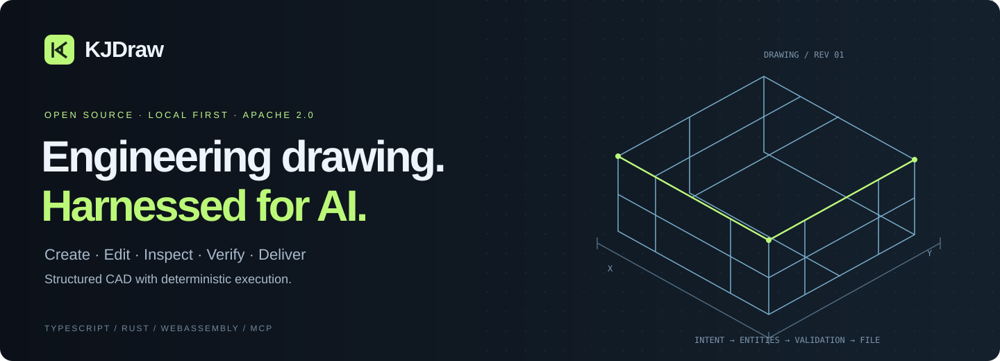
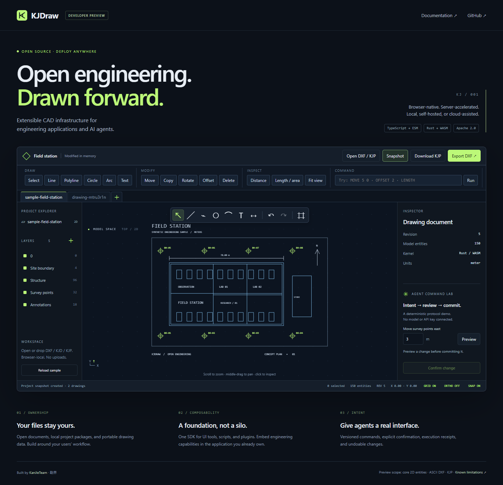
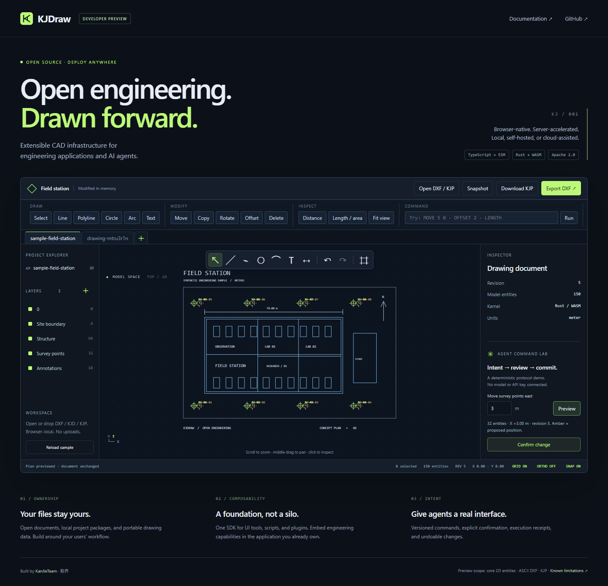

<p align="center"></p>

<p align="center"><strong>面向工程应用与 AI Agent 的可扩展 CAD 基础设施。</strong><br>浏览器原生运行，服务端按需增强，支持本地、私有化与云端部署。</p>
<p align="center"><a href="https://kanjieteam.github.io/kjdraw/"><strong>在线演示</strong></a> · <a href="#30-秒运行">30 秒运行</a> · <a href="docs/capability-matrix.md">能力矩阵</a> · <a href="README.md">English</a> · <a href="docs/architecture.md">架构</a> · <a href="docs/roadmap.md">路线图</a> · <a href="CONTRIBUTING.md">参与贡献</a></p>

## 为什么做 KJDraw

工程软件需要一套可以嵌入自身产品的 CAD 基础：从工程数据生成图纸，让用户继续编辑，能够检查修改、保存版本，并把文件带走。

我们在开发**勘界 Kanjie**的过程中持续遇到这个需求，因此将可复用的绘图基础独立出来，建设为开放项目。KJDraw 提供不依赖前端框架的 TypeScript/ESM SDK、Rust/WebAssembly 内核、部署 Provider 契约，以及使用同一套公共 API 的真实浏览器工作台。

我们希望它逐步成为岩土、地质、测绘和更多工程应用可以共同依赖的基础设施。勘界也是这个公共核心的使用者，通用改进优先回到这里。

## 当前验证基线

| 65 个可执行命令 | 28 种对象契约 | 88 个自动测试 | 7 版本 DXF 语料 |
| :---: | :---: | :---: | :---: |
| 事务与编辑 | 二维及受限实体网格 | SDK、文件、WASM、示例 | R14 至 2024 标签 |

这些数字来自仓库中的可运行代码，不代表已经具备所有商业 CAD 功能。详见[能力矩阵](docs/capability-matrix.md)和[当前限制](docs/status.md)。

## 30 秒运行

先打开在线演示：**[kanjieteam.github.io/kjdraw](https://kanjieteam.github.io/kjdraw/)**。图纸只在浏览器本地处理，不上传服务器。

安装 **Node.js 22 或更新版本**：

```sh
git clone https://github.com/KanJieTeam/kjdraw.git
cd kjdraw
node scripts/serve.mjs
```

打开 **http://localhost:4173**。无需安装 npm 依赖、注册账号、配置模型密钥或启动业务后端。仓库包含可重建的 WASM 文件和对应 Rust 源码。实际应用可以按需挂接工程存储、远程计算和大场景流送 Provider。

演示图由原创合成数据生成。可以打开或拖入 DXF/KJD/KJP，在一个工程中创建和切换多张图纸，生成覆盖全部图纸的工程快照，绘制直线、折线、圆、圆弧和文字，Shift 多选并整组变换，切换栅格、对象捕捉和正交约束，编辑图层与对象属性，测量几何，撤销、下载 KJP、导出 ASCII DXF。右侧 **Agent Command Lab** 可预览勘探点图层的移动，再由用户确认提交；琥珀色虚线表示建议位置。

这是确定性的命令协议演示，尚未接入大模型。文件在浏览器本地处理，演示不上传图纸，也不包含分析埋点。离开页面前请下载 KJP 保存修改。



<details><summary>查看修改计划的真实预览</summary>



</details>

## 首发提供什么

| 能力 | 当前范围 |
| --- | --- |
| 文档与文件 | 稳定对象 ID、CAD 句柄、图层、块、资源、版本、KJD 文档、KJP 工程包 |
| 通用工作台 | 多图纸标签、工程快照、多选、绘图约束、属性与测量、响应式布局 |
| 编辑 | 事务、撤销/重做、变换、选取、捕捉及部分精确修剪/延伸/偏移组合 |
| 交换 | 开发阶段的 ASCII DXF 核心子集；提供[七版本合成语料审计](docs/dxf-compatibility.md) |
| 扩展 | 命令、对象与文件适配器注册、插件版本与权限声明 |
| Agent 接口 | 修改计划、显式确认、预期版本检查、执行回执 |
| Rust/WASM | 文档校验与修订、基础几何查询、实验性实体网格运算 |
| 类型化接入 | TypeScript 类型声明与 TS 编写入口；迁移期间继续兼容浏览器 ESM |
| 部署 Provider | 工程存储、计算和场景接口；支持本地、私有化、云增强与混合部署 |

当前是 **Developer Preview**。不承诺完整 DWG 读写、全套打印出图或通用 BRep。演示画布的显示范围小于 SDK 的存储范围；不少二维编辑算法仍由 JavaScript 实现。详见[当前能力边界](docs/status.md)。

宿主必须管理用户身份、权限，并把批准绑定到具体参数和版本。命令中的确认字段是协议数据，不是安全沙箱或不可伪造的授权证明。

## 使用 SDK

```js
import { createKJDrawSDK } from './packages/kjdraw-sdk/src/index.js'

const sdk = createKJDrawSDK()
const drawing = sdk.createDocument({ documentId: 'first-drawing', units: 'meter' })
const line = await sdk.executeCommand('CREATE', {
  type: 'LINE', payload: { start: [0, 0, 0], end: [100, 0, 0] },
})
await sdk.executeCommand('MOVE', { id: line.id, dx: 5, dy: 0 })
await sdk.executeCommand('UNDO')
console.log(drawing.serialize({ pretty: true }))
```

## 一套核心，多种部署

```text
通用工作台 · 你的工程应用 · AI Agent
                  │
       文档 + 命令 + 文件 + 插件
                  │
      TypeScript SDK ↔ Rust/WASM
                  │
  本地工程 Provider · 私有化 Provider · 云端 Provider
```

KJDraw 核心不强制联网，也不禁止服务端能力。宿主可以显式注册工程存储、远程计算和大场景流送 Provider，不需要分叉 CAD 核心。注册 Provider 本身不会发起网络请求。参见[部署模型](docs/deployment.md)和可运行的[示例](examples/deployment-providers.mjs)。

## 开放基础，保护专业价值

KJDraw 开源通用 CAD 文档、几何、文件、工作台和扩展契约。勘界的专业成图算法、MDB 解释、行业模板、客户数据、知识库与企业服务保持独立。共享 CAD 修复先进入本仓库并发布版本，勘界再升级锁定依赖，避免重复开发。

详见[开源边界](docs/open-source-boundary.md)、[安全架构](SECURITY_ARCHITECTURE.md)和[下游集成约定](docs/downstream.md)。

## 一起建设

欢迎贡献几何修复、可复现的 DXF 兼容问题、文档、界面可访问性和第三方集成。公开提交的图纸应为合成数据或已获明确再分发授权的资料。

```sh
node scripts/test.mjs
node scripts/audit-dxf-corpus.mjs
node scripts/check.mjs
node scripts/build.mjs
```

勘界后续采用固定版本的开源核心。共享代码优先在本仓库修改，通过验证后再更新到勘界；专业业务、企业服务和私有数据保持独立。参见[下游集成约定](docs/downstream.md)和[路线图](docs/roadmap.md)。

由 [KanJieTeam](https://github.com/KanJieTeam) 维护 · 联系邮箱：[kanjieteam@163.com](mailto:kanjieteam@163.com)

采用 [Apache-2.0](LICENSE) 许可证。公开范围与来源见 [NOTICE](NOTICE) 和[来源说明](docs/provenance.md)。
