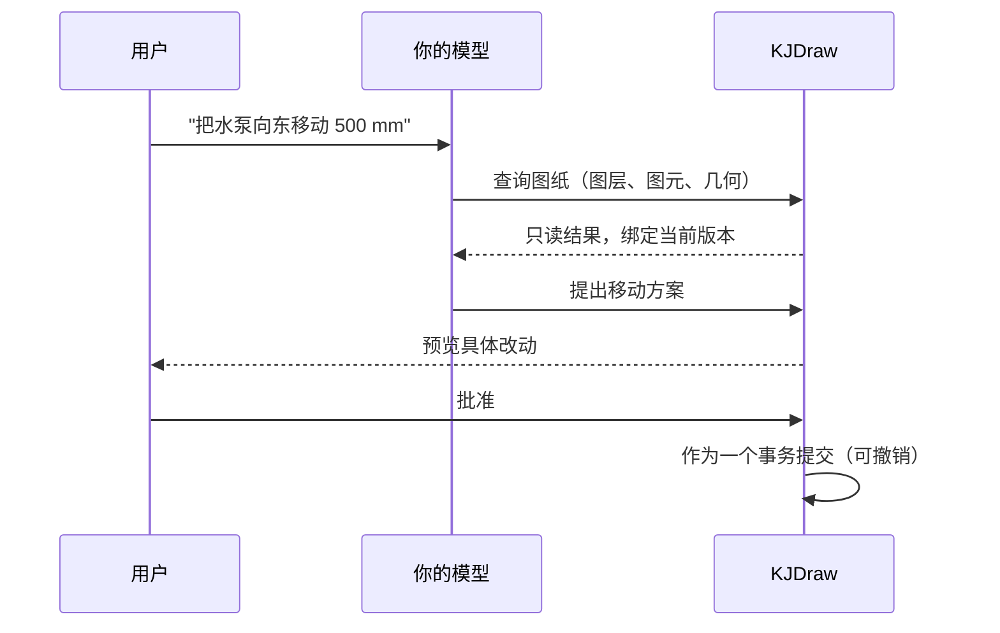

<div align="center">


# KJDraw

### 为 AI Agent 打造的开源 CAD 引擎

让 AI 修改真实的工程图纸：每一次改动都先预览、由人确认、随时可撤销。<br/>
也可以用一个组件，把完整的 CAD 编辑器嵌进你的 Web 应用。

[**▶ 在线体验**](https://kanjieteam.github.io/kjdraw/) · [**文档**](https://kanjieteam.github.io/kjdraw/docs/latest/) · [**Agent 指南**](https://kanjieteam.github.io/kjdraw/docs/latest/agent/) · [English](README.md)

[](https://github.com/KanJieTeam/kjdraw/releases)
[](https://www.npmjs.com/package/@kanjieteam/kjdraw)
[](LICENSE)

</div>

<!-- TODO（最重要）：用真实模型录制的 GIF 替换下面这张，录好后删掉说明里“预设场景”那句。 -->
<p align="center">
  <a href="https://kanjieteam.github.io/kjdraw/">
    
  </a>
  <br/>
  <sub>录制于内置工作台。图中 Agent 面板播放的是预设场景；接入你自己的模型请看下方 <a href="#-给你的-agent-装上-cad-工具">Agent 工具</a>。</sub>
</p>

<p align="center"><b>无需注册。文件在浏览器本地打开，不会上传。</b></p>

---

## 为什么选 KJDraw

**🤖 可信的 Agent 编辑。** Agent 可以读取图纸、提出修改，但在人确认具体改动之前，图纸不会有任何变化。每个修改提议都绑定到提出时的图纸版本，只能使用一次，并作为一个完整事务提交，撤销方式和手动编辑完全一样。

**📐 真正的 CAD 编辑器，不只是查看器。** 直线、多段线、圆弧、文字、尺寸标注和图层；移动、复制、旋转、偏移、阵列、修剪/延伸、倒角/圆角；捕捉、夹点和完整的撤销/重做。可保存为原生 KJD/KJP 或 DXF。

**🧩 随处嵌入，数据留在本地。** 原生 JS、React、Vue 都只需要一个组件。全程 TypeScript，可选 Rust/WASM 内核。默认纯浏览器本地运行，不需要后端，没有数据统计。

## 🤖 给你的 Agent 装上 CAD 工具

模型由你的应用提供；KJDraw 提供工具、审核环节和撤销历史。


```mermaid
sequenceDiagram
    participant U as 用户
    participant M as 你的模型
    participant K as KJDraw
    U->>M: "把水泵向东移动 500 mm"
    M->>K: 查询图纸（图层、图元、几何）
    K-->>M: 只读结果，绑定当前版本
    M->>K: 提出移动方案
    K-->>U: 预览具体改动
    U->>K: 批准
    K->>K: 作为一个事务提交（可撤销）
```

- **不绑定模型。** 内置多个模型 API 适配器，也支持自定义接口接入任何模型。
- **当前是起步工具集：** 查询图元和图层、测量、创建直线和圆、移动对象。更多工具在路线图上，[欢迎贡献](#参与贡献)。
- **不需要 API Key 也能试：** 克隆仓库后运行 [命令示例](examples/agent-command.mjs)，完整走一遍“提议 → 批准 → 撤销”。
  <!-- TODO：确认下面这条命令在 npm ci 之后可以直接运行 -->
  ```bash
  node examples/agent-command.mjs
  ```

[Agent 工作流指南](https://kanjieteam.github.io/kjdraw/docs/latest/agent/) · [接入模型](https://kanjieteam.github.io/kjdraw/docs/latest/models/) · [给编程 Agent 的集成说明](docs/agent.md)

## 📦 把 CAD 加进你的应用

```bash
npm install @kanjieteam/kjdraw@next
```

<!-- 等 npm 的 latest 标签指向 1.0.0-rc.3 或更新版本后，改成 npm install @kanjieteam/kjdraw，并删掉下面这句。 -->
> 截至 2026-09-28，npm 的 `next` 标签仍指向 `1.0.0-rc.2`。下方示例对应源码中的 `1.0.0-rc.3` 候选版；在该版本发布前，安装 `@next` 后可能无法直接运行。详见 [发布状态](docs/status.md) 和 [源码安装说明](https://kanjieteam.github.io/kjdraw/docs/latest/installation/)。

```html
<div id="cad" style="height: 720px"></div>
```

<!-- TODO：确认中文界面的 locale 取值（zh-CN 还是 zh） -->
```ts
import { createKJDrawEditor } from '@kanjieteam/kjdraw/editor'

const editor = createKJDrawEditor('#cad', {
  document: 'sample',
  locale: 'zh-CN',
  theme: 'dark',
  layout: 'classic', // 'classic' | 'compact' | 'focus'
})

await editor.ready
// await editor.open(file)                              // 来自文件选择器的 File
// await editor.save({ format: 'DXF', download: true })
```

<details>
<summary><b>React</b></summary>

```tsx
import { KJDraw } from '@kanjieteam/kjdraw/react'

export default function DrawingPage() {
  return <KJDraw document="sample" locale="zh-CN" style={{ height: 720 }} />
}
```

</details>

<details>
<summary><b>Vue 3</b></summary>

```vue
<script setup lang="ts">
import { KJDraw } from '@kanjieteam/kjdraw/vue'
</script>

<template>
  <KJDraw document="sample" locale="zh-CN" style="height: 720px" />
</template>
```

</details>

[快速开始](https://kanjieteam.github.io/kjdraw/docs/latest/quickstart/) · [React 指南](https://kanjieteam.github.io/kjdraw/docs/latest/react/) · [Vue 指南](https://kanjieteam.github.io/kjdraw/docs/latest/vue/) · [可运行示例](packages/kjdraw-sdk/examples) · [API 参考](https://kanjieteam.github.io/kjdraw/docs/latest/api/)

## KJDraw 适合你吗？

| ✅ 适合 | ⏳ 暂时不适合 |
| --- | --- |
| 你在做需要修改图纸的 AI 助手，并且希望由人把关 | 你需要直接打开和保存 DWG |
| 你需要在 Web 产品里嵌入 CAD 编辑器（审图、巡检、选型配置、内部工具） | 你需要完整的桌面 CAD 功能或三维实体建模 |
| 你要在脚本或 CI 里批量处理 DXF/KJD 文件，无界面、不上传 | 你需要经过认证的打印或出图输出 |

KJDraw 是用来构建产品和 Agent 工作流的引擎，不打算取代桌面 CAD。

## 目前能做什么

| 方面 | 状态 |
| --- | --- |
| **KJD** 原生图纸 | ✅ 读写、校验、事务、版本、撤销/重做 |
| **KJP** 项目包 | ✅ 一个包内多张图纸，含快照、哈希和命令日志 |
| **DXF**（ASCII） | ✅ 有文档说明的子集，R14–2024 版本标签，见 [兼容性说明](docs/dxf-compatibility.md) |
| 二进制 DXF | ❌ 不支持 |
| **DWG** | ❌ 不在 1.0 范围内，请先转换为 DXF（例如使用 ODA File Converter） |
| **3D** | 🧪 实验性：网格、基本体和盒体布尔运算 |
| 命令行工具 | ✅ 无界面检查、校验和转换 KJD、KJP、DXF，见 [文件指南](https://kanjieteam.github.io/kjdraw/docs/latest/files/) |

不支持的内容会被明确拒绝，而不是悄悄丢弃。完整边界见 [发布状态](docs/status.md) · [1.0 范围](docs/1.0-scope.md)。

## 参与贡献

**我们的目标：让 KJDraw 成为 AI 时代默认的开源 CAD 引擎。**

现在最有价值的贡献：

- **一张能让 KJDraw 出错的图纸。** 打不开或显示不对的真实 DXF 文件，是改进兼容性最快的方式。
- **新的 Agent 工具**和 Agent 示例。
- **编辑工具**、性能、无障碍和文档。

```bash
git clone https://github.com/KanJieTeam/kjdraw.git
cd kjdraw
npm ci --ignore-scripts
npm run dev          # http://localhost:4173
```

提交 PR 前请运行 `npm run typecheck` 和 `npm test`（界面改动还需 `npm run test:browser`）。较大的改动请先 [开 issue](https://github.com/KanJieTeam/kjdraw/issues) 讨论。参见 [贡献指南](CONTRIBUTING.md) · [项目治理](GOVERNANCE.md) · [路线图](docs/roadmap.md)。

---

<div align="center">

如果 KJDraw 对你有用，点个 ⭐ 能帮更多工程师发现它。

由 [KanJieTeam](https://github.com/KanJieTeam) 开发 · [kanjieteam@163.com](mailto:kanjieteam@163.com) · [Apache-2.0](LICENSE)

</div>
