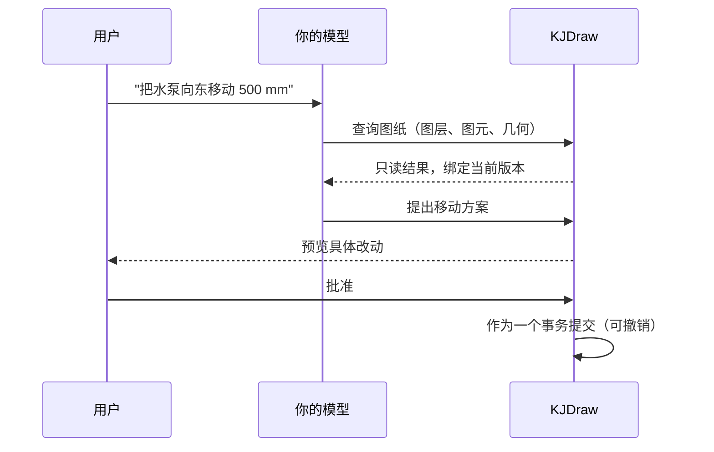

<div align="center">


# KJDraw

### 给 AI 装上真正的 CAD 能力

模型只需表达工程意图，KJDraw 负责把它编译为<br/>
可编辑、可验证、可撤销、可保存重开的真实 CAD 图纸。

**一键接入：** Kimi Code · TraeCode · WorkBuddy · ZCode

<!-- TODO：请在浏览器确认 /ai/ 链接打开的是 AI 绘图页，而不是普通编辑器 -->
[**快速开始**](#-快速开始) · [**AI 绘图**](https://kanjieteam.github.io/kjdraw/ai/) · [**在线编辑器**](https://kanjieteam.github.io/kjdraw/) · [**文档**](https://kanjieteam.github.io/kjdraw/docs/latest/) · [English](README.md)

[](https://github.com/KanJieTeam/kjdraw/releases)
[](https://www.npmjs.com/package/@kanjieteam/kjdraw)
[](LICENSE)

</div>

<!-- TODO（最重要）：用 Kimi Code / Trae 等真实客户端录一段 15～30 秒的视频或 GIF 替换下面这张：
     输入一句话 → 生成图纸 → 再说一句修改 → 图纸更新 → 撤销。录好后删掉说明里“预设场景”那句。 -->
<p align="center">
  <a href="https://kanjieteam.github.io/kjdraw/">
    
  </a>
  <br/>
  <sub>录制于内置工作台，图中 Agent 面板播放的是预设场景。在真实 AI 客户端中使用，请看下方快速开始。</sub>
</p>

## 为下一次修改而设计

生成一张“看起来像 CAD”的图已经不难。工程 CAD 真正的门槛是：在一张包含数百个关联对象的图纸里，让模型连续多轮都能找到同一个对象，保持尺寸、图层、块、填充和引用关系正确，并且在撤销、导出、保存、重开之后结果一致。

让 LLM 逐个输出坐标和基础图元，会迅速消耗 token，几何和约束容易漂移，对象没有稳定身份，下一轮修改只能靠猜。

KJDraw 给不同的模型和智能体提供同一套 CAD 执行层：**模型负责“画什么”，引擎负责“怎么正确地画”。** 几何、对象身份、图层、引用、事务、校验和文件输出，都由本地引擎确定性完成；缺少关键数据时直接拒绝，而不是猜。

## 🚀 快速开始

**在 AI 智能体中使用：** 在任意目录运行一次。安装器会把 KJDraw 接入当前用户的 **Kimi Code、WorkBuddy、ZCode**，之后在任意工作区都能用；**TraeCode** 会打开官方的一次性导入确认。模型 API Key 始终留在你的 AI 客户端，不交给 KJDraw。

**Windows PowerShell**

```powershell
irm https://raw.githubusercontent.com/KanJieTeam/kjdraw/main/scripts/install-ai.ps1 | iex
```

**macOS / Linux**

```bash
curl -fsSL https://raw.githubusercontent.com/KanJieTeam/kjdraw/main/scripts/install-ai.sh | sh
```

<!-- 建议：在这里加一个 <details>，给出手动配置 MCP 的 JSON 片段，照顾不愿意执行 curl | sh 的开发者 -->

安装后，在你的 AI 客户端里试试：

<!-- TODO：建议再加一句不需要额外数据、一定能成功的入门提示词 -->
```text
用 KJDraw 绘制一张工程地质柱状图，按钻孔数据生成分层、岩性花纹、标高和说明。
```

生成的图纸会保存为独立校验过的 KJD、DXF 和 SVG 文件，不会覆盖原图；原位修改和破坏性操作仍需审核确认。[安装细节与安全边界](docs/try-in-ai.zh-CN.md)

> **1.0 候选版状态：** 命令行配置和真实引擎冒烟测试已通过；四个客户端的界面与真实模型独立验收仍在进行中。

## 核心能力

| 能力 | 现在能做什么 |
| --- | --- |
| **读懂现有图纸** | 分页读取、空间与属性查询、稳定对象 ID、图层、块引用、拓扑和修改影响分析 |
| **高层工程成图** | 机械加工图、建筑平面图、场地与管线图、道路平纵横、柱状图、地质剖面图、折线图和柱状统计图 |
| **精确多轮改图** | 定位对象后移动、复制、旋转、缩放、偏移、拉伸、延长、改文字、换图层，以及删除后关系重建 |
| **确定性质量闭环** | 每次执行都检查几何、图层、引用和版本；一次修改对应一个可撤销事务，可保存、重开、再验证 |
| **嵌入你的产品** | 同一引擎提供 TypeScript/JavaScript SDK、React、Vue、完整编辑器、CLI、MCP 和本地文件工作流 |

## KJDraw 适合你吗？

| ✅ 适合 | ⏳ 暂时不适合 |
| --- | --- |
| 你想用 AI 智能体生成和反复修改工程图纸 | 你需要直接打开和保存 DWG |
| 你在做需要修改图纸的 AI 产品，并且希望由人把关 | 你需要完整的桌面 CAD 功能或三维实体建模 |
| 你需要在 Web 产品里嵌入 CAD 编辑器（审图、巡检、选型、内部工具） | 你需要经过认证的打印或出图输出 |
| 你要在脚本或 CI 里批量处理 DXF/KJD，无界面、不上传 | |

KJDraw 是 CAD 引擎和执行层，不打算取代桌面 CAD。

## 📦 接入你的应用

```bash
npm install @kanjieteam/kjdraw@next
```

<!-- 等 npm 的 latest 指向 1.0.0-rc.3 或更新版本后，改成 npm install @kanjieteam/kjdraw，并删掉下面这句。 -->
> 截至 2026-09-28，npm 的 `next` 标签仍指向 `1.0.0-rc.2`。下方示例对应源码中的 `1.0.0-rc.3` 候选版；在该版本发布前，安装 `@next` 后可能无法直接运行。详见 [版本状态](docs/status.md) 和 [源码安装说明](https://kanjieteam.github.io/kjdraw/docs/latest/installation/)。

```html
<div id="cad" style="height: 720px"></div>
```

```ts
import { createKJDrawEditor } from '@kanjieteam/kjdraw/editor'

const editor = createKJDrawEditor('#cad', {
  document: 'sample',
  locale: 'zh-CN',
  theme: 'dark',
  layout: 'classic', // 'classic' | 'compact' | 'focus'
})

await editor.ready
// await editor.open(file)                              // 来自文件选择框的 File
// await editor.save({ format: 'DXF', download: true })
```

<details>
<summary><b>React</b></summary>

```tsx
import { KJDraw } from '@kanjieteam/kjdraw/react'

export default function DrawingPage() {
  return <KJDraw document="sample" locale="zh-CN" style={{ height: 720 }} />
}
```

</details>

<details>
<summary><b>Vue 3</b></summary>

```vue
<script setup lang="ts">
import { KJDraw } from '@kanjieteam/kjdraw/vue'
</script>

<template>
  <KJDraw document="sample" locale="zh-CN" style="height: 720px" />
</template>
```

</details>

[快速开始](https://kanjieteam.github.io/kjdraw/docs/latest/quickstart/) · [React 指南](https://kanjieteam.github.io/kjdraw/docs/latest/react/) · [Vue 指南](https://kanjieteam.github.io/kjdraw/docs/latest/vue/) · [可运行示例](packages/kjdraw-sdk/examples) · [API 参考](https://kanjieteam.github.io/kjdraw/docs/latest/api/)

## 🤖 在你自己的产品里构建 CAD Agent

你的应用负责接入模型，KJDraw 提供 CAD 工具、审核环节和撤销历史。


```mermaid
sequenceDiagram
    participant U as 用户
    participant M as 你的模型
    participant K as KJDraw
    U->>M: "把水泵向东移动 500 mm"
    M->>K: 查询图纸（图层、图元、几何）
    K-->>M: 只读结果，绑定当前版本
    M->>K: 提出移动方案
    K-->>U: 预览具体改动
    U->>K: 批准
    K->>K: 作为一个事务提交（可撤销）
```

每个修改提议都绑定到提出时的图纸版本、只能使用一次，批准后作为一个完整事务提交，撤销方式和手动编辑一样。

- [构建 Agent 工作流](https://kanjieteam.github.io/kjdraw/docs/latest/agent/)：调用绘图工具，检查修改并应用
- [接入模型](https://kanjieteam.github.io/kjdraw/docs/latest/models/)：模型传输、预算和审批由宿主掌控
- [Agent 接入说明](docs/agent.md)：给编程 Agent 使用的接入指南
- [命令示例](examples/agent-command.mjs)：无需模型或 API Key，验证提议、批准和撤销

## 目前能做什么

| 方面 | 状态 |
| --- | --- |
| **KJD** 原生图纸 | ✅ 读写、校验、事务、版本、撤销/重做 |
| **KJP** 工程包 | ✅ 一个包内多张图纸，含快照、哈希和命令日志 |
| **DXF**（ASCII） | ✅ 有明确说明的子集，R14–2024 版本标签，见 [兼容范围](docs/dxf-compatibility.md) |
| 二进制 DXF | ❌ 不支持 |
| **DWG** | ❌ 不在 1.0 范围内，请先转换为 DXF（例如使用 ODA File Converter） |
| **3D** | 🧪 实验性：网格、基本体和盒体布尔运算 |
| 命令行 | ✅ 无界面检查、校验和转换 KJD、KJP、DXF，见 [文件指南](https://kanjieteam.github.io/kjdraw/docs/latest/files/) |

不支持的内容会被明确拒绝，而不是悄悄丢弃。完整边界见 [版本状态](docs/status.md) · [1.0 范围](docs/1.0-scope.md)。

## 参与贡献

**我们的使命：让 KJDraw 成为 AI 时代首选的开源 CAD 引擎。**

现在最有价值的贡献：

- **一张能让 KJDraw 出错的图纸。** 打不开或显示不对的真实 DXF 文件，是改进兼容性最快的方式。
- **在你用的 AI 客户端里试用并反馈**，尤其是生成失败或多轮修改出错的案例。
- **编辑工具、成图类型、性能、无障碍和文档。**

```bash
git clone https://github.com/KanJieTeam/kjdraw.git
cd kjdraw
npm ci --ignore-scripts
npm run dev          # http://localhost:4173
```

提交 PR 前请运行 `npm run typecheck` 和 `npm test`（界面修改还需 `npm run test:browser`）。较大改动请先 [开 Issue](https://github.com/KanJieTeam/kjdraw/issues) 讨论。参见 [贡献指南](CONTRIBUTING.md) · [治理规则](GOVERNANCE.md) · [路线图](docs/roadmap.md) · [获取支持](SUPPORT.md)。

## Star History

[](https://www.star-history.com/#KanJieTeam/kjdraw&Date)

---

<div align="center">

如果 KJDraw 对你有用，点个 ⭐ 能帮更多工程师发现它。

由 [KanJieTeam](https://github.com/KanJieTeam) 发起，欢迎全球开发者参与 · [kanjieteam@163.com](mailto:kanjieteam@163.com) · [Apache-2.0](LICENSE)

</div>
