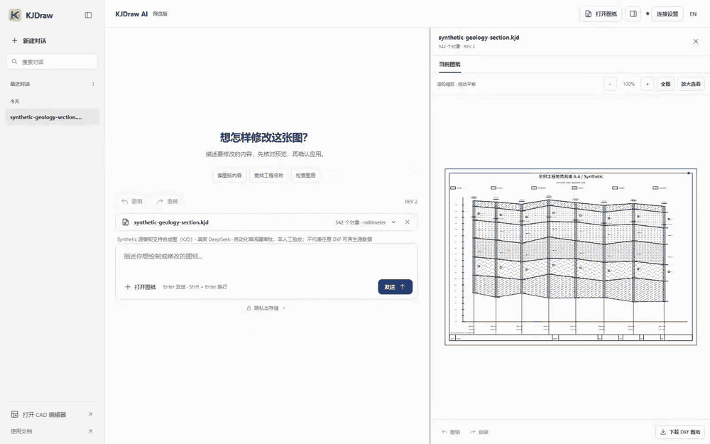
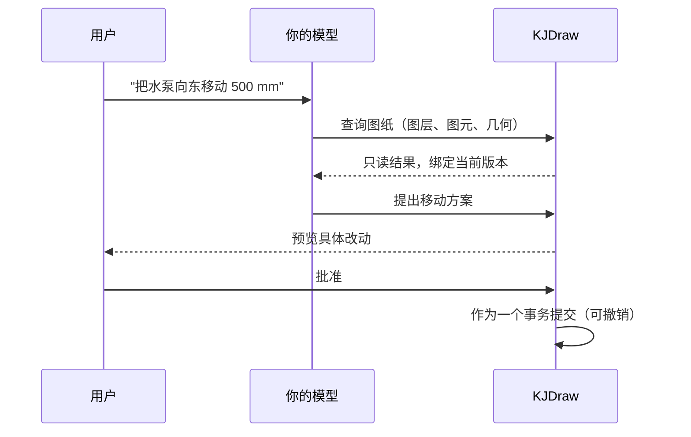

<div align="center">


# KJDraw

### 给 AI 装上真正的 CAD 能力

模型只需表达工程意图，KJDraw 负责把它编译为<br/>
可编辑、可验证、可撤销、可保存重开的真实 CAD 图纸。

[**快速开始**](#-快速开始) · [**AI 绘图**](https://kanjieteam.github.io/kjdraw/ai/) · [**在线编辑器**](https://kanjieteam.github.io/kjdraw/) · [**文档**](https://kanjieteam.github.io/kjdraw/docs/latest/) · [**贡献技能包**](docs/contributing-skills.zh-CN.md) · [English](README.md)

[](https://github.com/KanJieTeam/kjdraw/releases)
[](https://www.npmjs.com/package/@kanjieteam/kjdraw)
[](LICENSE)

</div>

<p align="center">
  <a href="https://kanjieteam.github.io/kjdraw/docs/media/ai-geology-live-20261003/">
    
  </a>
  <br/>
  <sub>真实 DeepSeek · 同一张合成剖面，十轮修改 · 精简录屏。<a href="https://kanjieteam.github.io/kjdraw/docs/media/ai-geology-live-20261003/">完整录屏与检查结果 ↗</a></sub>
</p>

## 画出来，还能继续改

KJDraw 生成的是可编辑的 CAD 对象，不是一次性图片。让智能体画一个零件后，还可以继续改孔径、移动对象或调整图层，无需整张重画。每次修改先预览、再确认；需要时可以撤销、保存并重新打开。

**模型决定画什么，KJDraw 负责执行 CAD 操作。**

## 🚀 快速开始

在 Codex、Claude Code、Cursor 等支持终端的智能体中使用（需要 Node.js 22+），只需执行一次：

```sh
npm install -g @kanjieteam/kjdraw
npx skills add KanJieTeam/kjdraw -g
```

第一条安装 CAD 引擎；第二条中选择 `kjdraw-cad` 和你使用的智能体。重启智能体后，直接说：

```text
用 KJDraw 画一个半径 5 毫米的圆。
```

检查修改提案，批准后导出为 **DXF** 图纸。Skill 通过 `kjdraw agent` 调用本地 CAD 引擎，**无需注册 MCP**。[审核与导出步骤](docs/try-in-ai.zh-CN.md#skill-优先的本地-cli)。

不想安装？打开[AI 绘图](https://kanjieteam.github.io/kjdraw/ai/)，在浏览器中连接自己的模型。请求和所需图纸上下文会发给所选服务商；对话、图纸和密钥保存在此浏览器。共用电脑请清除本站数据。[连接要求与其他智能体](docs/try-in-ai.zh-CN.md)。

## 核心能力

| 能力 | 当前范围 |
| --- | --- |
| **读懂现有图纸** | 已提供：对支持的对象进行分页读取、空间与属性查询、在线图档/KJD 内稳定的对象 ID、图层、块引用、拓扑和修改影响分析；DXF 重新导入可能生成新的内部 ID |
| **高层工程成图** | 示例工作流：机械加工图、建筑平面图、场地与管线图、道路平纵横、钻孔柱状图、地质剖面图、统计柱状图／条形图和折线图；完整生产流程仍在验证 |
| **多轮改图** | 已提供部分命令：对支持的对象及组合进行定位、移动、复制、旋转、缩放、偏移、拉伸、延长、改文字、换图层和删除；真实模型多轮任务仍需验证 |
| **审核与修订** | 已提供：绑定图纸版本的修改提案、真人审批、单事务提交、撤销，以及在支持范围内保存和重开检查 |
| **嵌入你的产品** | 已提供：同一引擎的 TypeScript/JavaScript SDK、React、Vue、完整编辑器、CLI、MCP 和本地文件工作流 |

## KJDraw 适合你吗？

| ✅ 适合 | ⏳ 暂时不适合 |
| --- | --- |
| 你想用 AI 智能体生成和反复修改工程图纸 | 你需要直接打开和保存 DWG |
| 你在做需要修改图纸的 AI 产品，并且希望由人把关 | 你需要完整的桌面 CAD 功能或三维实体建模 |
| 你需要在 Web 产品里嵌入 CAD 编辑器（审图、巡检、选型、内部工具） | 你需要经过认证的打印或出图输出 |
| 你要在脚本或 CI 里批量处理 DXF/KJD，无界面、不上传 | |

KJDraw 是 CAD 引擎和执行层，不打算取代桌面 CAD。

## 📦 在应用中嵌入 CAD

如果你开发 JavaScript 或 TypeScript 应用，请按单独的 [SDK 快速开始](https://kanjieteam.github.io/kjdraw/docs/latest/quickstart/)在项目中安装；不需要执行上面的智能体安装命令。嵌入 API 如下：

```html
<div id="cad" style="height: 720px"></div>
```

```ts
import { createKJDrawEditor } from '@kanjieteam/kjdraw/editor'

const editor = createKJDrawEditor('#cad', {
  document: 'sample',
  locale: 'zh-CN',
  theme: 'dark',
  layout: 'classic', // 'classic' | 'compact' | 'focus'
})

await editor.ready
// await editor.open(file)                              // 来自文件选择框的 File
// await editor.save({ format: 'DXF', download: true })
```

<details>
<summary><b>React</b></summary>

```tsx
import { KJDraw } from '@kanjieteam/kjdraw/react'

export default function DrawingPage() {
  return <KJDraw document="sample" locale="zh-CN" style={{ height: 720 }} />
}
```

</details>

<details>
<summary><b>Vue 3</b></summary>

```vue
<script setup lang="ts">
import { KJDraw } from '@kanjieteam/kjdraw/vue'
</script>

<template>
  <KJDraw document="sample" locale="zh-CN" style="height: 720px" />
</template>
```

</details>

[快速开始](https://kanjieteam.github.io/kjdraw/docs/latest/quickstart/) · [React 指南](https://kanjieteam.github.io/kjdraw/docs/latest/react/) · [Vue 指南](https://kanjieteam.github.io/kjdraw/docs/latest/vue/) · [可运行示例](packages/kjdraw-sdk/examples) · [API 参考](https://kanjieteam.github.io/kjdraw/docs/latest/api/)

## 🤖 在你自己的产品里构建 CAD Agent

你的应用负责接入模型，KJDraw 提供 CAD 工具、审核环节和撤销历史。


```mermaid
sequenceDiagram
    participant U as 用户
    participant M as 你的模型
    participant K as KJDraw
    U->>M: "把水泵向东移动 500 mm"
    M->>K: 查询图纸（图层、图元、几何）
    K-->>M: 只读结果，绑定当前版本
    M->>K: 提出移动方案
    K-->>U: 预览具体改动
    U->>K: 批准
    K->>K: 作为一个事务提交（可撤销）
```

每个修改提议都绑定到提出时的图纸版本、只能使用一次，批准后作为一个完整事务提交，撤销方式和手动编辑一样。

- [构建 Agent 工作流](https://kanjieteam.github.io/kjdraw/docs/latest/agent/)：调用绘图工具，检查修改并应用
- [接入模型](https://kanjieteam.github.io/kjdraw/docs/latest/models/)：模型传输、预算和审批由宿主掌控
- [Agent 接入说明](docs/agent.md)：给编程 Agent 使用的接入指南
- [命令示例](examples/agent-command.mjs)：无需模型或 API Key，验证提议、批准和撤销

## 文件格式与边界

使用 **DXF** 与其他 CAD 软件交换图纸。KJD、KJP 是可选的原生格式，用于保留 KJDraw 图档和工程状态。

| 方面 | 状态 |
| --- | --- |
| **DXF**（ASCII） | ✅ 有明确说明的子集，R14–2024 版本标签，见 [兼容范围](docs/dxf-compatibility.md) |
| 二进制 DXF | ❌ 不支持 |
| **DWG** | ❌ 不在 1.0 范围内，请先转换为 DXF（例如使用 ODA File Converter） |
| **KJD** 原生图纸 | ✅ 读写、校验、事务、版本、撤销/重做 |
| **KJP** 工程包 | ✅ 一个包内多张图纸，含快照、哈希和命令日志 |
| **3D** | 🧪 实验性：网格、基本体和盒体布尔运算 |
| 命令行 | ✅ 无界面检查、校验和转换 KJD、KJP、DXF，见 [文件指南](https://kanjieteam.github.io/kjdraw/docs/latest/files/) |

不支持的内容会被明确拒绝，而不是悄悄丢弃。完整边界见 [版本状态](docs/status.md) · [1.0 范围](docs/1.0-scope.md)。

## 参与贡献

**贡献你所在行业的技能包。** 从[技能目录](skills/README.md)和[中文开发指南](docs/contributing-skills.zh-CN.md)开始。行业包就是一个 `skills/kjdraw-<行业-任务>/` 目录，包含工作流及按需提供的模板、规则和辅助脚本。

**Fork → 新建 `skills/kjdraw-<topic>/` → 测试工作流 → 提交 PR。**

[技能包开发指南](docs/contributing-skills.zh-CN.md) · [技能目录与样例](skills/README.md) · [其他贡献类型](CONTRIBUTING.zh-CN.md) · [English Skill guide](docs/contributing-skills.md)。

写清输入、产物和验收方式。复用已有操作通常不需要修改内核；缺失的 planner、插件或内核能力请单独提案。

新技能包提供 `SKILL.md` 和**中文或英文任选一份 README** 即可，维护者可帮助补译。添加 `tests/community-<topic>.spec.mjs` 工作流测试后，在仓库根目录只需执行：

```sh
npm run check:skill
```

这条命令检查包结构并运行合成输入工作流测试，不代表真实模型验收。只检查自己的包时，追加 `-- skills/kjdraw-your-topic`，将目录名换成你的实际名称。最后更新[技能目录](skills/README.md)。

现在最有价值的贡献：

- **一个可安装的领域 Skill。** 参考[只读文字核对](skills/kjdraw-text-audit/README.zh-CN.md)、[机械孔阵列](skills/kjdraw-hole-pattern/README.zh-CN.md)或[图纸模板与图层规则](skills/kjdraw-sheet-template/README.zh-CN.md)，保留自己的短 `SKILL.md` 与必要资源，添加验证实际工作流的测试。
- **一个可复现的图纸问题。** 提交小型合成 DXF 或有权公开的最小样例，写明操作指令和预期结果；不要上传客户私有图纸。
- **一个可复用的工程工作流。** 有明确输入、可编辑 CAD 产物，以及修改、撤销、DXF 重开的测试。从[领域规划器示例](examples/domain-planner-starter/README.md)开始。
- **在你用的 AI 客户端里试用并反馈**，尤其是生成失败或多轮修改出错的案例。
- **编辑工具、成图类型、性能、无障碍和文档。**

```bash
git clone https://github.com/KanJieTeam/kjdraw.git
cd kjdraw
npm ci --ignore-scripts
npm run dev          # http://localhost:4173
```

浏览器打开 <http://localhost:4173>。只贡献技能包时运行 `npm run check:skill`；修改 SDK 或界面时，再按[中文贡献指南](CONTRIBUTING.zh-CN.md)执行对应检查。可从[行业包认领清单](docs/industry-skill-tasks.md)选择任务并[留言认领](https://github.com/KanJieTeam/kjdraw/issues/4)，也欢迎提出自己的任务。参见 [治理规则](GOVERNANCE.md) · [路线图](docs/roadmap.md) · [获取支持](SUPPORT.md)。

## Star History

[](https://www.star-history.com/#KanJieTeam/kjdraw&Date)

---

<div align="center">

如果 KJDraw 对你有用，点个 ⭐ 能帮更多工程师发现它。

由 [KanJieTeam](https://github.com/KanJieTeam) 发起，欢迎全球开发者参与 · [kanjieteam@163.com](mailto:kanjieteam@163.com) · [Apache-2.0](LICENSE)

</div>
